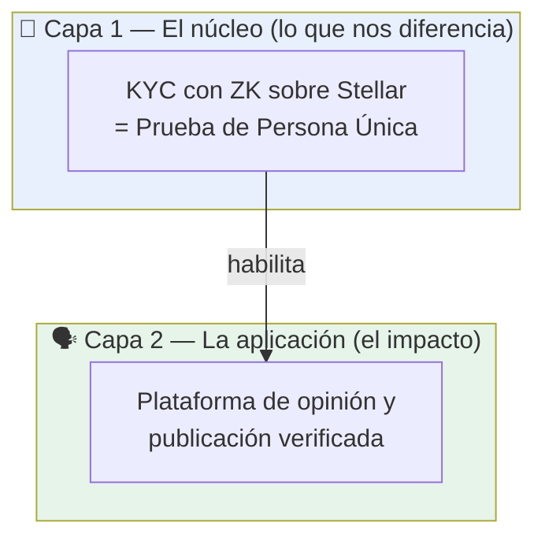

---
tags:
  - moc
---

# 💡 IDEA — Identidad verificada + voz pública sin riesgo

> **En una frase:** construir el **primer KYC con ZK sobre Stellar** que permite a cada
> persona validar su identidad real de forma **única y anónima**, y usar esa identidad
> como base de una **plataforma de opinión y publicación verificada** donde se puede
> hablar, debatir y compartir conocimiento sin ser juzgado y sin riesgo.

---
## La idea en dos capas

La propuesta tiene un **núcleo técnico** (lo difícil, lo que nos diferencia) y una
**aplicación** encima (el impacto que buscamos). Hay que resolver la capa 1 para habilitar
la capa 2.

---

## Capa 1 — El núcleo: KYC con ZK (Prueba de Persona Única)

Crear un sistema donde **cada persona se registra y valida su identidad real una sola
vez**, de forma **única** (una persona real = una identidad) y **anónima** (sin exponer
sus datos personales en la cadena), usando Zero-Knowledge sobre Stellar.

- Este KYC con ZK **todavía no existe en Stellar**. Eso nos favorece: sería una
  integración **construida desde cero**, no una copia de algo ya hecho.
- Tomamos como referencia [[zkME]] — un KYC con ZK que ya usan otras blockchains.
  Estudiamos cómo funciona para diseñar el nuestro.
- **El reto más grande está acá:** el "puente" de validar a cada persona de forma
  **anónima pero única** con la capa ZK. Es el problema central a resolver antes de
  avanzar.

→ Desarrollado en [[Prueba de Persona Única]]. Detalle técnico en
[[Diseño del Circuito ZK]], [[Modelo de Datos]] y [[Flujo de KYC]].

---

## Capa 2 — La aplicación: plataforma de opinión verificada

Una vez resuelta la validación, usamos esa identidad para generar **impacto social**:
una **plataforma on-chain** donde una persona puede **expresar su opinión sin sesgos ni
riesgo** en cualquier hilo o foro de discusión.

No es sólo opinión. La persona también puede **subir artículos, estudios e informes**
sobre problemáticas públicas que haya realizado. Todo lo que quiera que sea **conocido y
verídico bajo su identidad**, puede publicarlo.

→ Desarrollado en [[Plataforma de Opinión Verificada]].

---

## Curaduría: agentes validadores + moderación

Para que la plataforma no se "ensucie" (algo común cuando hay anonimato), sumamos una
capa de curaduría:

- **Agentes validadores de información** que revisan el contenido (veracidad de artículos,
  estudios, etc.) a modo de curaduría.
- Cuando un agente se topa con una problemática que **no sabe resolver**, la **deriva a
  moderadores** humanos.
- El objetivo es **no perder el criterio de la persona**: filtrar el ruido y el abuso sin
  silenciar opiniones legítimas.

→ Desarrollado en [[Curaduría y Agentes Validadores]].

---

## Anonimato ↔ responsabilidad: el equilibrio

Hay una tensión aparente: la validación es **anónima** (ZK oculta tus datos), pero
queremos **responsabilidad** sobre lo que se publica. Se resuelve así:

- Por defecto, la persona es **única y verificada** (una humana real, sin PII expuesta) →
  esto ya elimina bots y cuentas falsas.
- Sumamos una función donde **todo lo que la persona haga y opine sea público** (atado a
  su identidad). Esto ayuda a **definir mejor su forma de pensar** y a distinguir si una
  opinión nace **desde el odio** o de alguien que realmente quiere aportar.

→ Desarrollado en [[Identidad Pública vs Anónima]].

---

## Acceso y visibilidad — *decisión abierta*

La plataforma busca ser **libre**: toda persona podría ver todo (artículos, informes,
opiniones).

- 🔸 **A definir:** quizás restringimos la **lectura sólo a personas verificadas**, de modo
  que ver el contenido también requiera haber pasado el KYC con ZK.

→ Ver discusión en [[Identidad Pública vs Anónima#Visibilidad y acceso]].

---

## Por qué importa (el diferenciador)

- 🥇 **Primer KYC con ZK en Stellar** — construido desde cero, no existe aún.
- 🧍 **Persona única real** — base anti-bot / anti-sybil para cualquier cosa que se
  construya encima.
- 🌍 **Impacto social concreto** — una plaza pública donde el conocimiento y la opinión
  son verídicos y responsables, sin exponer la identidad de quien participa.

---

## Referencias

- [[zkME]] — KYC con ZK de referencia (otras blockchains): https://www.zk.me/

## Preguntas abiertas

- [ ] ¿Cómo garantizamos **unicidad** (una persona = una identidad) sin revelar quién es?
      → [[Prueba de Persona Única]]
- [ ] ¿La lectura del contenido es libre o sólo para verificados? → [[Identidad Pública vs Anónima#Visibilidad y acceso]]
- [ ] ¿Qué valida exactamente un agente y dónde empieza la moderación humana? → [[Curaduría y Agentes Validadores]]
- [x] **Nombre del proyecto:** `beHuman` *(nombre de trabajo, en definición)* → [[Vision General#Nombre del proyecto]]

> 🔁 Nota para el equipo: las notas [[Vision General]] y [[Casos de Uso]] se escribieron
> antes con un enfoque genérico (compliance / rampas fiat). Conviene realinearlas a esta
> dirección (plataforma de opinión verificada) cuando cerremos la idea.
