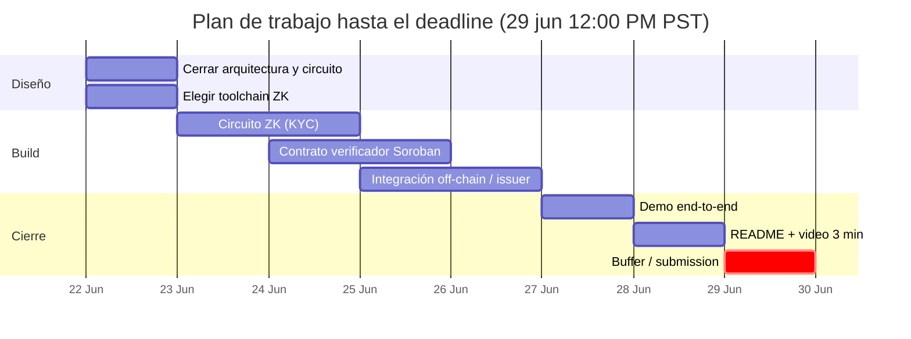

---
tags:
  - hackathon
---

# Fechas Clave

| Evento | Fecha |
|---|---|
| Apertura de submissions | 15 de junio, 12:00 AM PST |
| **Deadline de submission** | **29 de junio, 12:00 PM PST** |

> 🗓️ Hoy es **2026-06-22**. Quedan aproximadamente **7 días** para el deadline.

## Cuenta regresiva mental

## Hitos propios

- [x] **22 jun** — arquitectura y toolchain cerradas
- [x] **25 jun** — circuito + verificador funcionando aislados
- [x] **27 jun** — flujo end-to-end en testnet
- [x] **28 jun** — README pulido + video grabado
- [ ] **29 jun** — submission antes de las 12:00 PM PST (con buffer)

Ver: [[Roadmap]] · [[Plan de Demo]]
