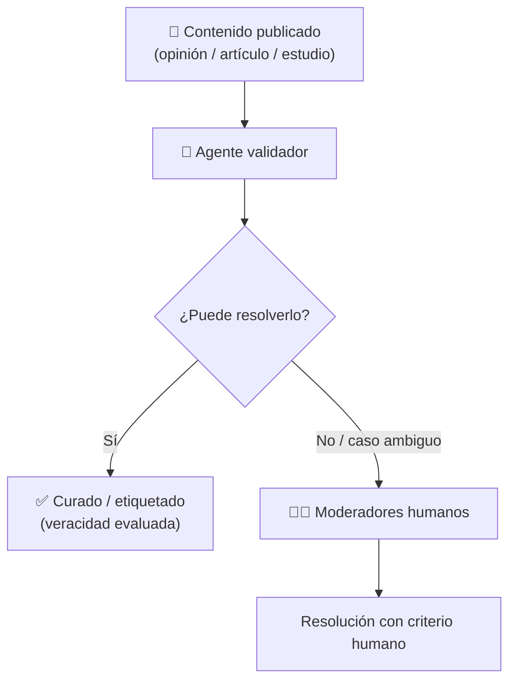

# Curaduría y Agentes Validadores

La capa que mantiene la **calidad y veracidad** del contenido de la
[[Plataforma de Opinión Verificada]] sin silenciar a las personas. Desarrolla la idea de
curaduría planteada en [[IDEA]].

## El problema que resuelve

Aunque cada usuario sea una [[Prueba de Persona Única|persona real y única]], el contenido
**igual se puede ensuciar**: desinformación, artículos sin respaldo, discurso de odio. El
reto es filtrar eso **sin perder el criterio de la persona** — es decir, sin convertirse
en censura.

## Cómo funciona: curaduría en dos niveles

### Nivel 1 — Agentes validadores (automático)

Agentes de IA que actúan como **curadores**: revisan el contenido y evalúan su veracidad
y calidad (por ejemplo: ¿el estudio cita fuentes?, ¿el artículo es coherente y
verificable?, ¿hay señales de abuso?).

### Nivel 2 — Moderadores humanos (derivación)

Cuando un agente **se topa con una problemática que no sabe resolver** (un caso ambiguo,
sensible o fuera de su criterio), **lo deriva a moderadores** humanos. Así se combina la
escala de la automatización con el **criterio humano** para los casos difíciles.

## Principio rector

> **No perder el criterio de la persona.** La curaduría busca filtrar ruido, abuso y
> desinformación — **no** acallar opiniones legítimas. La derivación a humanos existe
> justamente para que ningún caso dudoso se resuelva con un automatismo ciego.

## Relación con la identidad

La curaduría se apoya en que cada autor es una persona única y, opcionalmente, en que su
actividad puede ser **pública** (ver [[Identidad Pública vs Anónima]]). Cuando el
comportamiento de una persona es público y persistente, es más fácil distinguir si una
intervención **nace desde el odio** o de alguien que **realmente quiere aportar** — y eso
alimenta el criterio de la curaduría.

## Implementación (en `main`, `platform/curation`)

Ya está construida (PR #3 y #4), **off-chain y aditiva** (no toca el circuito ni el contrato).
Detalle técnico en [[Implementación Capa 2 (plataforma)#6. Curaduría (`platform/curation`) — moderación off-chain y aditiva]].

- **Nivel 1 — agente IA:** usa la API de Claude (`@anthropic-ai/sdk`, modelo configurable).
  Rúbrica: veracidad/fuentes, coherencia, toxicidad, plagio → `approved` / `flagged` / `escalated`.
- **Nivel 2 — cola humana:** los `escalated` van a una cola de moderación (`queue.ts`); el feed
  publica `approved` + `flagged` y oculta los `escalated` hasta revisión humana.
- **Regla de oro (codificada):** discrepar con una idea NO se modera; solo abuso/desinfo/plagio.
- **Fail-safe:** si el modelo falla → se escala (ante la duda, humano).
- **Anonimato preservado:** la curaduría ve **solo contenido + `platformId`** (seudónimo),
  nunca address ni PII. Como `platformId` es determinístico por humano, un baneo es
  **resistente a evasión** sin deanonimizar → [[Identidad anónima de plataforma (platformId)#Anti-Sybil resistente a evasión]].

## Preguntas abiertas

- [x] ¿Qué evalúa el agente? → veracidad/fuentes, coherencia, toxicidad, plagio (rúbrica en `rubric.ts`).
- [x] ¿Límite agente ↔ humano? → casos ambiguos/sensibles se **escalan** (fail-safe a humano).
- [x] ¿On-chain / off-chain? → **off-chain** (veredictos off-chain; anclar el hash = futuro).
- [ ] ¿Cómo se eligen y gobiernan los moderadores? (¿personas verificadas? ¿reputación?)
- [ ] ¿Hay apelación de una decisión de moderación?
- [ ] Calibrar la rúbrica con casos reales (decisión de producto fina).

Relacionado: [[IDEA]] · [[Plataforma de Opinión Verificada]] · [[Identidad Pública vs Anónima]] ·
[[Prueba de Persona Única]] · [[Identidad anónima de plataforma (platformId)]] ·
[[Implementación Capa 2 (plataforma)]]
