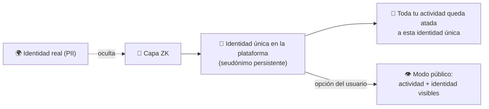

---
tags:
  - concepto
  - anonimato
---

# Identidad Pública vs Anónima

Cómo conviven el **anonimato** (que da la capa ZK) y la **responsabilidad** (que necesita
la plataforma). Resuelve la tensión planteada en [[IDEA]].

## La tensión

- La validación es **anónima**: la [[Prueba de Persona Única]] demuestra que sos real y
  único **sin exponer tu PII**. → bueno para opinar **sin miedo a ser juzgado**.
- Pero el anonimato total **se ensucia**: sin ninguna consecuencia, aparece el abuso, el
  odio y la desinformación.

¿Cómo tener lo mejor de ambos? Separando **dos cosas que normalmente van juntas**:

1. **Quién sos en el mundo real** (tu PII) → permanece **privada**.
2. **Quién sos en la plataforma** (tu identidad única persistente) → siempre **atribuible**
   a tus actos, aunque sea bajo seudónimo.

## El modelo: anonimato responsable

- Por defecto: **seudónimo único y verificado**. Nadie sabe tu nombre, pero **es una sola
  persona real** detrás (no podés multiplicarte → ver nullifier en
  [[Prueba de Persona Única]]).
- Como la identidad es **única y persistente**, tus actos tienen **continuidad y
  reputación**, aunque tu nombre real esté oculto. Eso ya frena gran parte del abuso.

## La función de "modo público"

Sumamos una función donde la persona puede hacer que **todo lo que haga y opine sea
público**. Esto sirve para:

- **Definir mejor su forma de pensar** — su historial visible da contexto a cada opinión.
- **Distinguir intención** — ayuda a discernir si una opinión nace **desde el odio** o de
  alguien que **realmente quiere aportar**. Esa señal alimenta la
  [[Curaduría y Agentes Validadores|curaduría]].
- **Dar autoridad** a artículos y estudios — quien firma con su identidad real respalda su
  trabajo.

## Espectro de identidad

| Modo | PII real | Actividad | Cuándo conviene |
|---|---|---|---|
| **Anónimo verificado** (default) | Oculta | Atada a un seudónimo único | Opinar sin miedo en temas sensibles |
| **Público** (opt-in) | Visible si la persona quiere | Pública y atribuible | Publicar estudios/artículos con autoridad |

> La persona **elige** dónde pararse en el espectro, pero **siempre** es una persona real
> y única detrás.

## Visibilidad y acceso

*Decisión abierta de [[IDEA]].* La plataforma busca ser **libre**: idealmente toda persona
puede ver todo (artículos, informes, opiniones).

- 🔸 **Alternativa en evaluación:** restringir la **lectura sólo a personas verificadas**,
  de modo que para consumir el contenido también haya que haber pasado la
  [[Prueba de Persona Única]]. Sube la calidad de la comunidad pero reduce el alcance.

| Opción | Pro | Contra |
|---|---|---|
| Lectura libre para todos | Máximo alcance e impacto | Menos control sobre la audiencia |
| Lectura sólo para verificados | Comunidad 100% de personas reales | Barrera de entrada, menos difusión |

> Pendiente de decidir con el equipo.

Relacionado: [[IDEA]] · [[Prueba de Persona Única]] · [[Plataforma de Opinión Verificada]] · [[Curaduría y Agentes Validadores]] · [[Problema y Solucion]]
