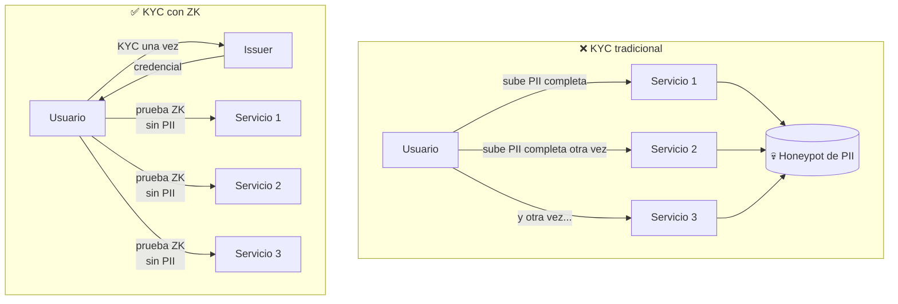

---
tags:
  - concepto
---

# Problema y Solución

## El problema

El KYC tradicional es un desastre para la privacidad y para la experiencia:

1. **Sobre-exposición de datos.** Cada plataforma (exchange, rampa fiat, banco,
   protocolo DeFi regulado) te pide subir pasaporte, selfie, comprobante de domicilio…
   y guarda esa copia. Cada copia es un punto de fuga.

2. **Repetición.** Haces el mismo KYC una y otra vez en cada servicio. Es lento y
   frustrante.

3. **Honeypots de datos.** Las empresas acumulan montañas de PII (información personal
   identificable) que se convierten en objetivos de hackeo. Las brechas de datos KYC son
   constantes.

4. **Incompatible con la privacidad on-chain.** En una blockchain pública, exigir
   compliance normalmente significa **doxear** la identidad o la actividad del usuario.
   Cumplimiento y privacidad parecen enemigos.

## La solución (ZK)

Separar la **verificación de identidad** (hacerla una vez, con un issuer de confianza)
de la **prueba de cumplimiento** (hacerla muchas veces, sin revelar datos), usando
Zero-Knowledge.

- El usuario verifica su identidad **una sola vez** con un issuer KYC.
- Recibe una **credencial** firmada (un compromiso criptográfico a sus atributos).
- Cuando una dApp necesita saber que cumple, el usuario genera una **prueba ZK** que
  demuestra el predicado (*"soy mayor de edad y pasé KYC nivel 2"*) **sin revelar** su
  nombre, fecha de nacimiento ni documento.
- La prueba se **verifica on-chain en Stellar**; nadie almacena PII en la cadena.

## Qué revela y qué oculta cada prueba

| Dato | ¿Se revela? |
|---|---|
| Nombre, documento, fecha de nacimiento | ❌ Nunca |
| Que pasaste KYC con un issuer de confianza | ✅ Sí (sin decir quién eres) |
| Predicado concreto (ej. `edad ≥ 18`, `país ∉ lista sancionada`) | ✅ Solo el booleano |
| Tu dirección Stellar (binding usuario↔prueba) | ✅ Sí (para evitar reventa de pruebas) |

## Supuestos y límites

- Se confía en que el **issuer** hizo bien la verificación de identidad. El ZK no
  elimina al issuer; elimina la **re-exposición** de datos a terceros. → [[Modelo de Datos]]
- El issuer podría coludir con un verificador si comparten el identificador del usuario;
  mitigamos con *nullifiers* y *blinding*. → [[Diseño del Circuito ZK]]
- Revocación de credenciales es difícil y queda como *future work* en el MVP.

Relacionado: [[Vision General]] · [[Casos de Uso]] · [[Diseño del Circuito ZK]]
