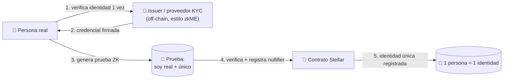

---
tags:
  - concepto
  - capa/1-identidad
  - zk
---

El **núcleo técnico** del proyecto y nuestro diferenciador. Desarrolla la Capa 1 de
[[IDEA]].

## Qué es

Una prueba criptográfica de que quien se registra es:

1. **Una persona real** — pasó un proceso de verificación de identidad (KYC).
2. **Única** — una persona real sólo puede tener **una** identidad en el sistema (no puede
   registrarse dos veces ni crear cuentas falsas).
3. **Anónima** — todo lo anterior se demuestra **sin exponer sus datos personales** (PII)
   en la cadena.

Es lo que en la jerga se llama *proof of personhood* / *proof of unique humanity*. Sobre
esta base se construye todo lo demás: si la persona es única y real, una opinión o
publicación vale como la de **un humano verificado**, no la de un bot ni una granja de
cuentas.

## Por qué es lo más difícil (y lo que nos diferencia)

El "puente" de validar a cada persona **de forma anónima pero única** es el problema
central de [[IDEA]]. Las dos propiedades parecen chocar:

- Si es **anónima**, ¿cómo evito que la misma persona se registre 100 veces? (sybil)
- Si garantizo **unicidad**, ¿no necesito saber quién es y romper el anonimato?

La respuesta es Zero-Knowledge + un **nullifier de unicidad** (abajo).

> Este KYC con ZK **aún no existe en Stellar** → lo construimos desde cero. Referencia:
> [[zkME]].

## Cómo funciona (a alto nivel)

1. La persona verifica su identidad real **una sola vez** con un issuer/proveedor de KYC.
2. Recibe una **credencial** firmada (un compromiso a sus atributos, sin que nada se
   publique). → [[Modelo de Datos]]
3. Genera una **prueba ZK** off-chain de que posee una credencial válida. → [[Diseño del Circuito ZK]]
4. El [[Contrato Verificador (Soroban)|contrato en Stellar]] verifica la prueba y registra
   un **nullifier de unicidad**.
5. Como ese nullifier es **determinístico por persona**, si intenta registrarse de nuevo
   el contrato detecta que el nullifier ya existe y lo rechaza → **unicidad garantizada**.

Flujo complet o en [[Flujo de KYC]].

## El mecanismo clave: nullifier de unicidad

Un **nullifier** es un valor único derivado del secreto de la persona. Para garantizar
unicidad **global** (una persona = una identidad en toda la plataforma), el nullifier se
deriva de algo intrínseco a su identidad verificada, de modo que **la misma persona
siempre produce el mismo nullifier**, pero **nadie puede deducir quién es** a partir de él.

- Mismo humano → mismo nullifier → el contrato lo rechaza la segunda vez (anti-sybil).
- El nullifier **no revela** identidad (es un hash unidireccional). → [[Glosario]]

> ⚠️ Punto fino de diseño: que el nullifier sea único **por persona** (no por dispositivo
> ni por sesión) depende de que el issuer ate la credencial a un identificador estable de
> la identidad real (sin publicarlo). Es el detalle más delicado a resolver. → ver
> [[Notas y Referencias]].

## Qué se prueba y qué se oculta

| Dato | ¿Se revela on-chain? |
|---|---|
| Nombre, documento, datos personales (PII) | ❌ Nunca |
| Que sos una persona real verificada | ✅ Sí (sin decir quién) |
| Que sos **única** (no registrada antes) | ✅ Sí (vía nullifier) |
| Tu identidad real | ❌ No (salvo que elijas hacerla pública → [[Identidad Pública vs Anónima]]) |

## Qué habilita

Sobre esta prueba se construye la [[Plataforma de Opinión Verificada]]: cada cuenta es un
humano real y único, lo que hace posible debate y publicación **sin bots, sin granjas de
cuentas y sin exponer identidades**.

Relacionado: [[IDEA]] · [[Identidad Pública vs Anónima]] · [[Diseño del Circuito ZK]] · [[Modelo de Datos]] · [[zkME]]
