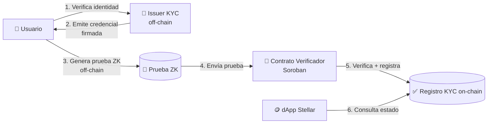

---
tags:
  - concepto
---

# Visión General

## Qué construimos

Un sistema de **KYC (Know Your Customer) con Zero-Knowledge sobre Stellar**. Permite que
una persona **demuestre que pasó un proceso de verificación de identidad** —y que cumple
ciertas condiciones (mayor de edad, país permitido, nivel de KYC, etc.)— **sin revelar
sus datos personales** a la dApp o al verificador on-chain.

La prueba ZK se genera off-chain y se **verifica dentro de un contrato inteligente de
Stellar (Soroban)**, que entonces marca la dirección del usuario como "KYC-verificada"
en un registro on-chain. Otras dApps de Stellar pueden consultar ese registro para abrir
funcionalidad regulada (rampas fiat, pools, tokens de RWA) sin tocar nunca datos
personales.

## La idea en una imagen

Detalle completo en [[Arquitectura General]] y [[Flujo de KYC]].

## Propuesta de valor

- **Privacidad:** la dApp sabe *"este usuario está verificado"*, no *quién es*.
- **Reutilización:** verificas tu identidad una vez; pruebas el cumplimiento muchas veces.
- **Cumplimiento (compliance):** encaja con el mundo regulado donde Stellar ya opera
  (stablecoins, pagos, RWAs).
- **On-chain y barato:** aprovecha las [[Primitivas ZK en Stellar]] (BN254, Poseidon)
  para verificar pruebas de forma eficiente.

## Por qué encaja en la hackathon

El tema sugiere explícitamente *"identity and compliance proofs"* como caso de uso ideal,
y pide que el **ZK sea load-bearing**. Aquí el ZK *es* el producto: sin él no hay forma de
probar el cumplimiento sin filtrar datos. Ver [[Reglas y Requisitos]].

## Alcance para el hackathon (MVP)

Lo realista en ~7 días (ver [[Roadmap]]):

- ✅ Un circuito ZK que prueba *"tengo una credencial KYC válida firmada por un issuer de
  confianza y cumplo predicado X (ej. mayor de 18)"*.
- ✅ Un contrato Soroban que verifica esa prueba y registra el address.
- ✅ Un issuer *mock* que firma credenciales (declarado como mock en el README).
- ✅ Una demo: usuario → credencial → prueba → verificación on-chain → dApp consulta.

Fuera de alcance del MVP (mencionar como *future work*): múltiples issuers federados,
revocación de credenciales, recovery, soulbound tokens, UI pulida.

## Nombre del proyecto

> 🏷️ **Nombre de trabajo: `beHuman`** *(provisional, en proceso de definición)*.
>
> Captura el núcleo del producto: **proof of personhood** — demostrar que sos una persona
> real y única ([[Prueba de Persona Única]]) sin revelar quién sos. El monorepo de código
> vive bajo la organización **beHuman** en GitHub (ver [[Estructura del Codigo]]).

Candidatos previos de brainstorming (por si reabrimos la decisión):

- **zkID** / **StellID** / **Stellaris ID**
- **Proof of Person(hood)** → **Proven**, **Prova**
- **Veil** (velo = privacidad) · **Aegis** (escudo/compliance) · **Sello**
- **Nova KYC** · **Anon-KYC** · **Privado**

Relacionado: [[Problema y Solucion]] · [[Casos de Uso]] · [[Glosario]]
