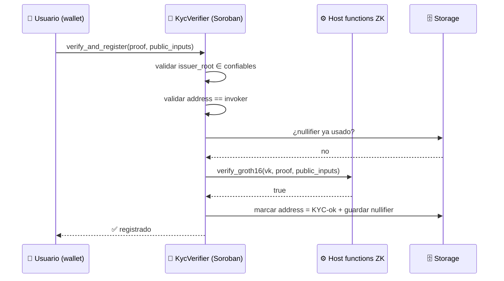

---
tags:
  - stellar
  - capa/1-identidad
  - soroban
---

El corazón on-chain del proyecto: un contrato Soroban que **verifica la prueba ZK** y
mantiene el **registro de addresses con KYC válido**.

## Responsabilidades

1. **Verificar** la prueba ZK contra la verifying key embebida y los public inputs.
2. **Validar** los public inputs (que la raíz del issuer sea de confianza, que el address
   de la prueba sea el que firma la transacción, que el nullifier no se haya usado).
3. **Registrar** el address como KYC-verificado en storage persistente.
4. **Exponer** una consulta `is_verified(address)` para que otras dApps la lean.



## Esqueleto (Groth16 / [[Circom]] — opción recomendada)

> Pseudocódigo orientativo. El verificador real puede partir del ejemplo oficial
> `groth16_verifier` de soroban-examples (ver [[Recursos Oficiales]]).

```rust
#![no_std]
use soroban_sdk::{contract, contractimpl, contracttype, Address, Bytes, BytesN, Env, Vec};

#[contracttype]
pub enum DataKey {
    Verified(Address),     // address -> bool
    Nullifier(BytesN<32>), // nullifier usado -> bool
    TrustedRoot,           // raíz Merkle del issuer de confianza
    VerifyingKey,          // VK del circuito
}

#[contract]
pub struct KycVerifier;

#[contractimpl]
impl KycVerifier {
    /// Inicializa con la raíz del issuer y la verifying key del circuito.
    pub fn init(env: Env, trusted_root: BytesN<32>, vk: Bytes) {
        env.storage().instance().set(&DataKey::TrustedRoot, &trusted_root);
        env.storage().instance().set(&DataKey::VerifyingKey, &vk);
    }

    /// Verifica la prueba ZK y registra al invocador como KYC-verificado.
    pub fn verify_and_register(
        env: Env,
        caller: Address,
        proof: Bytes,
        public_inputs: Vec<BytesN<32>>, // [issuer_root, address_hash, nullifier, predicado...]
    ) -> bool {
        caller.require_auth();

        // 1. La raíz del issuer en los públicos debe ser la de confianza
        let trusted: BytesN<32> = env.storage().instance().get(&DataKey::TrustedRoot).unwrap();
        // assert public_inputs[0] == trusted

        // 2. El nullifier no debe haberse usado (anti-replay / anti-doble registro)
        // let nf = public_inputs[2];
        // assert !storage.has(Nullifier(nf))

        // 3. Verificar la prueba con host functions BN254 / MSM (Groth16)
        // let ok = groth16_verify(env, vk, proof, public_inputs);
        // assert ok

        // 4. Persistir
        env.storage().persistent().set(&DataKey::Verified(caller.clone()), &true);
        // env.storage().persistent().set(&DataKey::Nullifier(nf), &true);
        true
    }

    /// Consulta pública para otras dApps.
    pub fn is_verified(env: Env, who: Address) -> bool {
        env.storage().persistent().get(&DataKey::Verified(who)).unwrap_or(false)
    }
}
```

## Public inputs del circuito (contrato ↔ prueba)

El contrato y el [[Diseño del Circuito ZK|circuito]] deben acordar exactamente qué señales
son públicas y en qué orden:

| Índice | Señal pública  | Para qué                                                   |
| ------ | -------------- | ---------------------------------------------------------- |
| 0      | `issuer_root`  | El contrato comprueba que es un issuer de confianza        |
| 1      | `address_hash` | Binding de la prueba al address del usuario (anti-reventa) |
| 2      | `nullifier`    | Anti-replay / anti doble registro                          |
| 3+     | `predicado(s)` | Ej. `is_adult = 1`, `country_ok = 1`                       |

## Consideraciones de Soroban

- **State archival / TTL:** el registro `Verified(address)` vive en storage `Persistent`;
  recordar renovar TTL o documentar expiración. → [[Stellar y Soroban]]
- **Costo:** la verificación usa las host functions de [[Primitivas ZK en Stellar]];
  Groth16 es la más barata. Medir gas/CPU en testnet.
- **Verificador base:** no reinventar — partir del `groth16_verifier` oficial.

Relacionado: [[Diseño del Circuito ZK]] · [[Arquitectura General]] · [[Modelo de Datos]]
