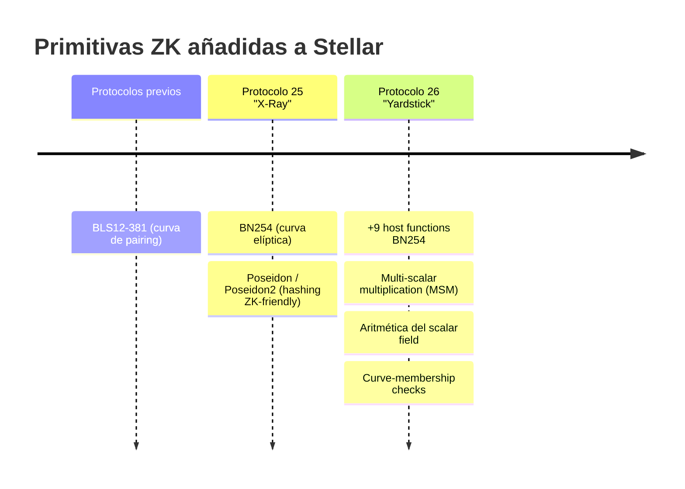

---
tags:
  - stellar
  - zk
---

# Primitivas ZK en Stellar

Stellar pasó las últimas releases de protocolo construyendo la base criptográfica que los
sistemas ZK modernos necesitan. Estas primitivas viven como **host functions** (nativas
del runtime, baratas) en vez de implementarse en Wasm.

## Línea de tiempo de protocolos

## Qué nos da cada pieza

| Primitiva | Para qué sirve en ZK | Release |
|---|---|---|
| **BLS12-381** | Curva de pairing alternativa para SNARKs | Previo |
| **BN254 (alt_bn128)** | Curva de pairing base de Groth16 y muchos SNARKs | P25 |
| **Poseidon / Poseidon2** | Hash barato *dentro* del circuito (commitments, Merkle trees) | P25 |
| **MSM (multi-scalar mult.)** | Operación pesada en la verificación de SNARKs | P26 |
| **Aritmética scalar field** | Operar en el campo escalar de BN254 | P26 |
| **Curve-membership checks** | Validar que un punto está en la curva | P26 |

El **Protocolo 26 ("Yardstick")** movió la matemática pesada de ZK a la capa host,
abaratando la verificación on-chain de forma significativa — **incluyendo pruebas de
NoirLang**.

## Qué significa esto para nuestro proyecto

- Podemos **verificar zk-SNARKs on-chain de forma eficiente y económica** en Soroban.
- **Poseidon** es ideal para los *commitments* de la credencial KYC y para el Merkle tree
  del issuer (es ZK-friendly → barato dentro del circuito). → [[Diseño del Circuito ZK]]
- **BN254 + MSM** es lo que usa el [[Contrato Verificador (Soroban)|verificador Groth16]]
  para chequear la prueba.

> ⚠️ **Importante (expectativas):** estas primitivas son *building blocks*. **No** te dan
> pagos privados end-to-end por sí solas. Generas la prueba **off-chain** con un sistema
> de alto nivel ([[Noir]], [[Circom]], [[RISC Zero]]) y despliegas un **contrato
> verificador** en Stellar para chequearla. Ese hueco entre primitivas y producto es
> donde vive nuestro proyecto.

## Implicación en la elección de toolchain

- **[[Circom]] + Groth16** → la verificación encaja directamente con BN254 + MSM; es la
  opción **más barata de verificar** on-chain. Hay un `groth16_verifier` oficial en
  soroban-examples.
- **[[Noir]] + UltraHonk** → ahora más barato gracias a P26, pero las pruebas son más
  grandes; verificador comunitario (`rs-soroban-ultrahonk`).
- **[[RISC Zero]]** → verificador vía Nethermind; mejor para cómputo grande off-chain.

Comparativa y decisión en [[Comparativa de Herramientas ZK]].

Relacionado: [[Stellar y Soroban]] · [[Reglas y Requisitos]]
