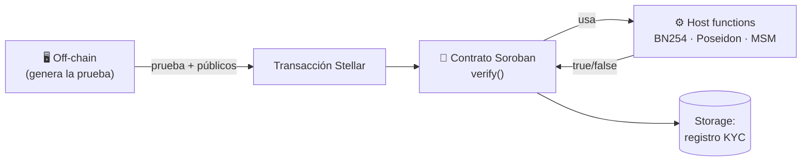

---
tags:
  - stellar
  - soroban
---

# Stellar y Soroban

## Stellar en una cápsula

Stellar es una blockchain pública enfocada en **mover dinero real**: stablecoins, pagos
transfronterizos, tokenización de activos del mundo real (RWA) y settlement
institucional. Es rápida, barata y con finalidad en segundos. Token nativo: **XLM**.

Esto importa para nosotros: el caso de uso de **KYC / compliance** es nativo del mundo
donde Stellar opera (rampas fiat, finanzas reguladas). Ver [[Casos de Uso]].

## Soroban: smart contracts

**Soroban** es la plataforma de contratos inteligentes de Stellar:

- Contratos escritos en **Rust**, compilados a **Wasm**.
- SDK: `soroban-sdk`. CLI: `stellar` (antes `soroban`).
- Modelo de almacenamiento con TTL (los datos expiran si no se renuevan → *state
  archival*). Hay que tenerlo en cuenta para el [[Modelo de Datos|registro KYC]].
- Tipos de storage: `Instance`, `Persistent`, `Temporary`.

### Estructura mínima de un contrato Soroban

```rust
#![no_std]
use soroban_sdk::{contract, contractimpl, Env, BytesN, Vec};

#[contract]
pub struct KycVerifier;

#[contractimpl]
impl KycVerifier {
    /// Verifica una prueba ZK y registra el address si es válida.
    pub fn verify_and_register(
        env: Env,
        proof: Bytes,
        public_inputs: Vec<BytesN<32>>,
    ) -> bool {
        // 1. Verificar la prueba usando host functions BN254 / Poseidon
        // 2. Si es válida, escribir en storage Persistent que el address está KYC-ok
        // (pseudocódigo — ver Contrato Verificador (Soroban))
        true
    }
}
```

Detalle del verificador en [[Contrato Verificador (Soroban)]].

## Por qué Stellar para ZK ahora

Las últimas releases de protocolo añadieron las primitivas criptográficas que los SNARKs
necesitan, como **host functions** (nativas y baratas) en vez de tener que
implementarlas en Wasm. Esto hace que verificar pruebas on-chain sea **viable y
económico**. Detalle completo en [[Primitivas ZK en Stellar]].



## Herramientas de desarrollo

- **stellar-cli** (`stellar`) — build, deploy, invoke de contratos.
- **Stellar Laboratory** — explorar y firmar transacciones en testnet.
- **Testnet** — para la demo del hackathon (XLM gratis vía friendbot).

Setup paso a paso en [[Setup del Entorno]].

Relacionado: [[Primitivas ZK en Stellar]] · [[Contrato Verificador (Soroban)]] · [[Arquitectura General]]
