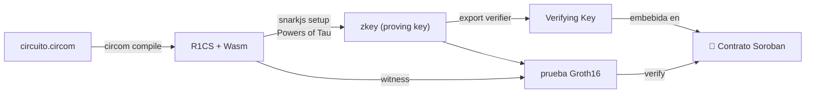

---
tags:
  - zk
---

# Circom

DSL de **bajo nivel** para escribir circuitos ZK basados en *constraints*. Genera pruebas
**Groth16**. Circom 1.0 era muy matemático; **2.0 es más accesible** y las herramientas
de IA ayudan bastante.

## Pros / Contras para Stellar

- ✅ **Verificación más barata** on-chain (Groth16 → pruebas pequeñas).
- ✅ **Verificador oficial** en soroban-examples (`groth16_verifier`) → menos riesgo.
- ✅ Encaja directo con las [[Primitivas ZK en Stellar|primitivas BN254 + MSM]] de Stellar.
- ✅ Ecosistema maduro (circomlib trae Poseidon, Merkle, comparadores, EdDSA…).
- ❌ Lenguaje **más áspero** y propenso a errores de constraints.
- ❌ **Trusted setup por circuito** (ceremonia Powers of Tau + phase 2).

## Recursos

- Docs: https://docs.circom.io/
- Groth16 Verifier Contracts (oficial): https://github.com/stellar/soroban-examples/tree/main/groth16_verifier
- Tutorial E2E: https://jamesbachini.com/circom-on-stellar/
- `circomlib` — librería de componentes (Poseidon, Merkle, EdDSA, comparadores).

## Flujo de trabajo típico



## Cómo se sentiría nuestro circuito KYC en Circom

> Boceto ilustrativo. Detalle conceptual en [[Diseño del Circuito ZK]].

```text
pragma circom 2.1.0;
include "poseidon.circom";
include "comparators.circom";

template KycCredential() {
    // privados
    signal input birthYear;
    signal input countryCode;
    signal input secret;
    // públicos
    signal input issuerRoot;
    signal input addressHash;
    signal input nullifier;
    signal input currentYear;
    signal output isAdult;

    // 1. commitment = Poseidon(birthYear, countryCode, secret)
    component h = Poseidon(3);
    h.inputs[0] <== birthYear;
    h.inputs[1] <== countryCode;
    h.inputs[2] <== secret;

    // 2. (Merkle/firma del issuer contra issuerRoot) ...

    // 3. predicado edad >= 18
    component ge = GreaterEqThan(8);
    ge.in[0] <== currentYear - birthYear;
    ge.in[1] <== 18;
    isAdult <== ge.out;

    // 4. nullifier = Poseidon(secret, addressHash)
    component nf = Poseidon(2);
    nf.inputs[0] <== secret;
    nf.inputs[1] <== addressHash;
    nullifier === nf.out;
}

component main {public [issuerRoot, addressHash, nullifier, currentYear]} = KycCredential();
```

## Por qué es nuestra opción recomendada

Verificación **más barata**, **soporte oficial** y encaje directo con Stellar lo hacen la
apuesta de menor riesgo para el MVP del hackathon. Ver decisión en
[[Comparativa de Herramientas ZK]].

Relacionado: [[Noir]] · [[RISC Zero]] · [[Contrato Verificador (Soroban)]]
