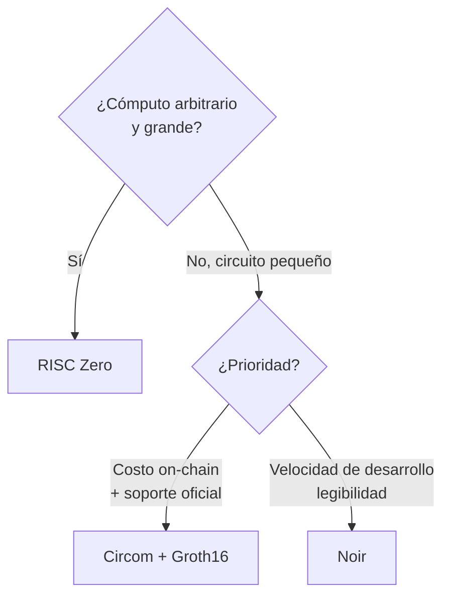

---
tags:
  - zk
---

# Comparativa de Herramientas ZK

Tres caminos probados para ZK en Stellar. Aquí decidimos cuál usar para el MVP.

## Tabla comparativa

| Criterio | [[Circom]] (Groth16) | [[Noir]] (UltraHonk) | [[RISC Zero]] (zkVM) |
|---|---|---|---|
| Modelo | Constraints de bajo nivel | Lenguaje tipo Rust | Programa Rust en zkVM |
| Curva de aprendizaje | Alta | **Baja** | Media |
| Tamaño de prueba | **Pequeña** | Grande | Media (wrapped SNARK) |
| Costo de verificación on-chain | **El más barato** | Medio-alto (mejor desde P26) | Medio |
| Trusted setup | Sí (por circuito) | Universal | No (prácticamente) |
| Verificador en Stellar | ✅ Oficial (`groth16_verifier`) | Comunitario (`rs-soroban-ultrahonk`) | Nethermind verifier |
| Ideal para | Circuitos pequeños y baratos | DX rápida, lógica legible | Cómputo grande off-chain |
| Tutorial E2E | jamesbachini.com/circom-on-stellar | jamesbachini.com/noir-on-stellar | jamesbachini.com/stellar-risc-zero-games |

## Análisis para nuestro caso (KYC)

Nuestro circuito es **pequeño y bien definido**: verificar una firma/Merkle proof y
evaluar un par de predicados (edad, país). No necesitamos una zkVM de propósito general.
Eso descarta **RISC Zero** salvo que queramos cómputo arbitrario.

Queda **Circom vs Noir**:

- **Circom + Groth16** → la **verificación más barata** on-chain (clave en un hackathon
  donde el ZK debe correr en Stellar), verificador **oficial** en soroban-examples, y
  encaja directo con BN254 + MSM. Contras: lenguaje más áspero, trusted setup por
  circuito.
- **Noir** → **mucho mejor DX** (legible, rápido de iterar en 7 días), pruebas más caras
  de verificar (aunque P26 lo abarató), verificador comunitario.

## Decisión propuesta

> 🎯 **Recomendación para el MVP:** **Circom + Groth16**.
>
> Razón: verificación on-chain **más barata**, **verificador oficial** en soroban-examples
> (menos riesgo en un plazo corto), y encaja directo con las
> [[Primitivas ZK en Stellar|primitivas BN254]] de Stellar. El "ZK load-bearing" queda
> demostrado de forma limpia y barata.
>
> **Plan B / DX:** si el desarrollo en Circom se vuelve un cuello de botella, pivotar a
> **Noir** por su legibilidad, asumiendo pruebas más caras.

> ⚠️ **Decisión aún abierta** — confirmar tras un spike de 1 día probando el
> `groth16_verifier` oficial. Ver [[🏠 Home#❓ Decisiones abiertas]] y [[Roadmap]].

Relacionado: [[Fundamentos ZK]] · [[Diseño del Circuito ZK]] · [[Primitivas ZK en Stellar]]
