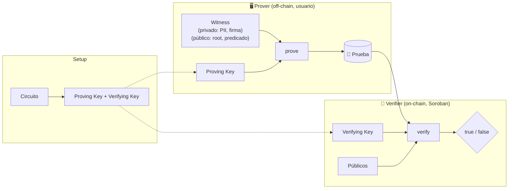

# Fundamentos ZK

Base conceptual mínima para entender el resto del proyecto. Términos definidos en
[[Glosario]].

## ¿Qué es una prueba Zero-Knowledge?

Una prueba criptográfica de que **una afirmación es verdadera**, sin revelar **nada más**
que su veracidad. El ejemplo clásico: probar que conoces la contraseña sin decir la
contraseña.

Tres propiedades:

1. **Completitud** — si la afirmación es cierta, un prover honesto convence al verificador.
2. **Solidez (soundness)** — si es falsa, un prover tramposo no puede convencer (salvo
   probabilidad despreciable).
3. **Zero-knowledge** — el verificador no aprende nada salvo que la afirmación es cierta.

## Aplicado a nuestro KYC

> **Afirmación:** *"Poseo una credencial KYC firmada por un issuer de confianza, atada a
> mi dirección Stellar, y cumplo el predicado (edad ≥ 18 y país permitido)."*
>
> **Sin revelar:** nombre, documento, fecha de nacimiento ni país concreto.

## Anatomía de un sistema ZK

- **Circuito:** define qué se prueba como un sistema de *constraints*. → [[Diseño del Circuito ZK]]
- **Witness:** los valores que satisfacen el circuito; parte **privada** (secreto) +
  parte **pública**.
- **Setup:** genera proving key y verifying key. La VK se embebe en el
  [[Contrato Verificador (Soroban)|contrato]].
- **Prove:** se hace **off-chain** (es lo pesado).
- **Verify:** se hace **on-chain** (es lo barato), usando las
  [[Primitivas ZK en Stellar]].

## SNARK vs STARK (y por qué SNARK aquí)

- **zk-SNARK** — pruebas pequeñas, verificación rápida y barata. Algunos requieren
  *trusted setup* (Groth16) o uno universal (PLONK/UltraHonk). ✅ Encaja con verificación
  on-chain barata en Stellar.
- **zk-STARK** — sin trusted setup, post-cuántico, pero pruebas más grandes. RISC Zero usa
  STARKs internamente y los "envuelve" en un SNARK para verificación on-chain barata.

Para este proyecto trabajamos con **SNARKs** porque Stellar verifica BN254/Groth16 de
forma nativa y económica. → [[Comparativa de Herramientas ZK]]

## Conceptos que usaremos en el circuito

- **Commitment (Poseidon):** el issuer firma un hash de los atributos; el circuito prueba
  conocer la preimagen sin revelarla.
- **Merkle proof:** prueba de que la credencial pertenece al set del issuer, contra una
  `issuer_root` pública.
- **Nullifier:** evita que la misma credencial se registre dos veces / sybil.
- **Address binding:** ata la prueba al address que la presenta (anti-reventa).

Todo esto se concreta en [[Diseño del Circuito ZK]].

Relacionado: [[Glosario]] · [[Comparativa de Herramientas ZK]]
