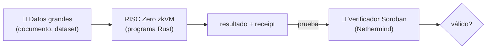

# RISC Zero

Una **zkVM**: un entorno de ejecución donde corres un programa (en Rust) sobre grandes
cantidades de datos **off-chain** y luego **pruebas que se ejecutó correctamente**,
verificando el resultado en un contrato Stellar.

## Pros / Contras para Stellar

- ✅ **Cómputo arbitrario** — escribes Rust normal, no piensas en constraints.
- ✅ **Sin trusted setup** (usa STARKs internamente, envueltos en un SNARK para
  verificación barata).
- ✅ Ideal cuando la lógica es **grande o compleja** (parsear documentos, OCR, reglas
  extensas de compliance).
- ❌ **Overkill** para un circuito pequeño como el nuestro (firma + 2 predicados).
- ❌ Pruebas/verificación más pesadas que Groth16.

## Recursos

- Docs: https://dev.risczero.com/
- Verificador para Stellar (Nethermind): https://github.com/NethermindEth/stellar-risc0-verifier/
- Tutorial E2E: https://jamesbachini.com/stellar-risc-zero-games/

## Cuándo lo elegiríamos

Si el KYC creciera hacia **verificación de documentos directamente** (ej. parsear y
validar un pasaporte, ejecutar reglas extensas de sanciones sobre datasets) dentro de la
prueba, una zkVM como RISC Zero sería la herramienta adecuada porque expresar eso como
constraints en [[Circom]]/[[Noir]] sería inviable.

## Veredicto para el MVP

Lo dejamos **fuera del MVP** (nuestro circuito es pequeño), pero lo documentamos como la
ruta natural si el alcance se expande a cómputo pesado. Ver
[[Comparativa de Herramientas ZK]].

Relacionado: [[Noir]] · [[Circom]] · [[Comparativa de Herramientas ZK]]
