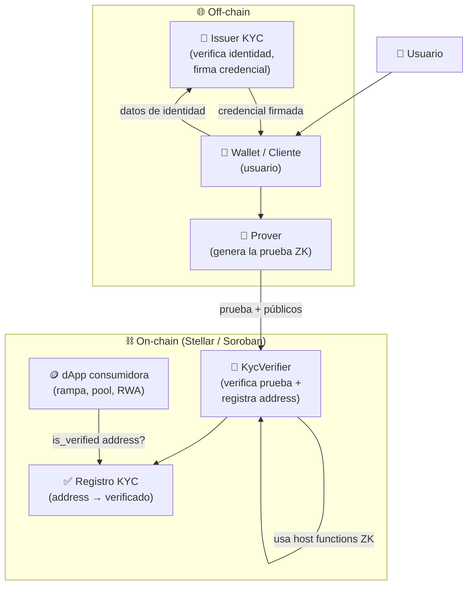
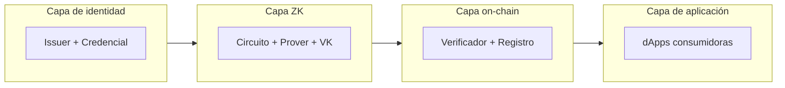

# Arquitectura General

Vista de pájaro de todos los componentes y cómo se conectan. Los flujos detallados están
en [[Flujo de KYC]].

## Componentes

## Quién hace qué

| Componente | Dónde | Responsabilidad |
|---|---|---|
| **Issuer KYC** | Off-chain | Verifica identidad real (una vez) y emite credencial firmada. En el MVP es un **mock** (declarado en README). → [[Modelo de Datos]] |
| **Wallet / Cliente** | Off-chain | Guarda la credencial del usuario; orquesta el flujo. |
| **Prover** | Off-chain | Genera la prueba ZK a partir de la credencial + predicado. Es el cómputo pesado. → [[Diseño del Circuito ZK]] |
| **KycVerifier** | On-chain (Soroban) | Verifica la prueba con [[Primitivas ZK en Stellar\|host functions]] y registra el address. → [[Contrato Verificador (Soroban)]] |
| **Registro KYC** | On-chain (storage) | Mapa `address → verificado` + nullifiers usados. |
| **dApp consumidora** | On-chain | Consulta `is_verified(address)` para abrir funcionalidad regulada. → [[Casos de Uso]] |

## Principio de diseño clave: dónde corre cada cosa

- **Generar la prueba = off-chain** (caro, privado). El usuario nunca expone su PII.
- **Verificar la prueba = on-chain** (barato gracias a las primitivas de Stellar).

Esta separación es el corazón de por qué el ZK es *load-bearing*: sin él no hay forma de
que el contrato confíe en el cumplimiento del usuario sin recibir sus datos.

## Vista de capas

Relacionado: [[Flujo de KYC]] · [[Diseño del Circuito ZK]] · [[Modelo de Datos]] · [[Contrato Verificador (Soroban)]]
