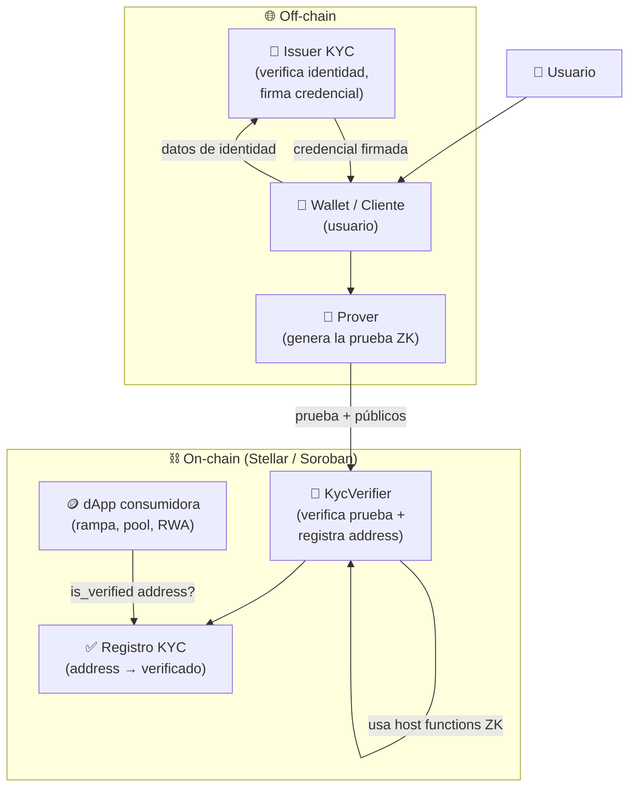
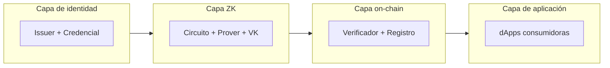
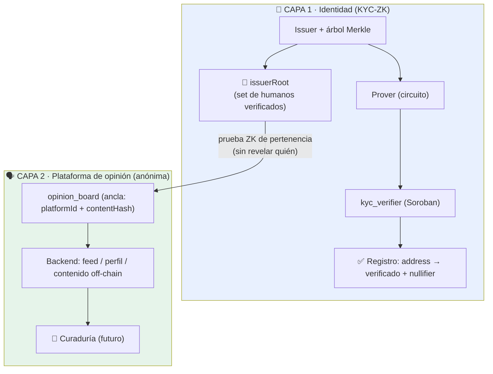

# Arquitectura General

Vista de pájaro de todos los componentes y cómo se conectan. Los flujos detallados están
en [[Flujo de KYC]].

## Componentes

## Quién hace qué

| Componente | Dónde | Responsabilidad |
|---|---|---|
| **Issuer KYC** | Off-chain | Verifica identidad real (una vez) y emite credencial firmada. En el MVP es un **mock**; para testnet ese paso lo hace el [[Matcher de Identidad (Gate de Capa 1)\|matcher de cara]] (DNI + cámara). → [[Modelo de Datos]] |
| **Wallet / Cliente** | Off-chain | Guarda la credencial del usuario; orquesta el flujo. |
| **Prover** | Off-chain | Genera la prueba ZK a partir de la credencial + predicado. Es el cómputo pesado. → [[Diseño del Circuito ZK]] |
| **KycVerifier** | On-chain (Soroban) | Verifica la prueba con [[Primitivas ZK en Stellar\|host functions]] y registra el address. → [[Contrato Verificador (Soroban)]] |
| **Registro KYC** | On-chain (storage) | Mapa `address → verificado` + nullifiers usados. |
| **dApp consumidora** | On-chain | Consulta `is_verified(address)` para abrir funcionalidad regulada. → [[Casos de Uso]] |

## Principio de diseño clave: dónde corre cada cosa

- **Generar la prueba = off-chain** (caro, privado). El usuario nunca expone su PII.
- **Verificar la prueba = on-chain** (barato gracias a las primitivas de Stellar).

Esta separación es el corazón de por qué el ZK es *load-bearing*: sin él no hay forma de
que el contrato confíe en el cumplimiento del usuario sin recibir sus datos.

## Vista de capas

## beHuman completo: las dos capas juntas

La capa 4 (*dApp consumidora*) **es** la [[Plataforma de Opinión Verificada]].

### Los dos puentes entre capas

Hay **dos formas** de consumir la identidad de Capa 1, según se necesite identidad o anonimato:

| Puente | Para qué | Cómo |
|---|---|---|
| **`is_verified(address)`** | dApps genéricas (rampas, pools, RWA): "este address es un humano único". | El consumidor consulta el registro on-chain por address. **Seudónimo (linkeable al address).** |
| **Pertenencia a `issuerRoot`** | La **plataforma anónima**: "soy un humano del set verificado, pero no digo cuál". | Prueba ZK de inclusión Merkle, identidad = `platformId`. **Anónimo (no toca el address).** |

> 🔑 La plataforma de opinión usa el **segundo** puente: nunca el address.
> → [[Identidad anónima de plataforma (platformId)]].

- **Identidad en la plataforma:** `platformId = Poseidon(secret, SCOPE)` → [[Identidad Pública vs Anónima]].
- **Almacenamiento capa 2:** híbrido (ancla on-chain + contenido off-chain).
- **Fee on-chain:** cuenta efímera (no el address del KYC).
- **Curaduría:** off-chain, aún no implementada → [[Curaduría y Agentes Validadores]].

### Mapeo arquitectura → código (monorepo `beHuman`)

| Componente | Capa | Carpeta del repo |
|---|---|---|
| Issuer KYC (mock) | 1 | `identity/issuer/` |
| Circuito + Prover | 1 | `identity/circuits/` + `packages/sdk/` |
| KycVerifier + Registro | 1 | `identity/contracts/kyc_verifier/` |
| Circuito de plataforma (membership + platformId) | 2 | `platform/circuits/` |
| Plataforma (ancla on-chain) | 2 | `platform/contracts/opinion_board/` |
| Backend / feed / perfil / contenido | 2 | `platform/api/` |
| Curaduría (agentes + moderación) | 2 | `platform/curation/` *(futuro)* |
| Frontend (Capa 1 + Capa 2) | — | `web/src/kyc/` + `web/src/platform/` |

→ Estructura completa en [[Estructura del Codigo]].

Relacionado: [[Flujo de KYC]] · [[Diseño del Circuito ZK]] · [[Modelo de Datos]] ·
[[Contrato Verificador (Soroban)]] · [[Plataforma de Opinión Verificada]] ·
[[Identidad anónima de plataforma (platformId)]] · [[Implementación Capa 2 (plataforma)]]
