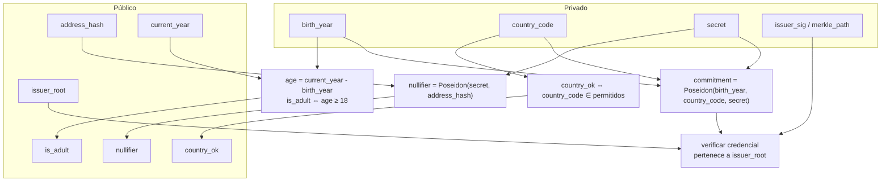

# Diseño del Circuito ZK

El detalle criptográfico de **qué** prueba el circuito. Conceptos base en
[[Fundamentos ZK]]; herramienta en [[Comparativa de Herramientas ZK]].

## Afirmación que prueba el circuito

> *"Conozco una credencial KYC válida emitida por un issuer de confianza
> (`issuer_root`), atada a mi dirección Stellar (`address_hash`), y los atributos de esa
> credencial satisfacen el predicado (`edad ≥ 18` y `país ∈ permitidos`) — sin revelar
> ninguno de esos atributos."*

## Entradas

### Privadas (witness — no se revelan)

| Señal | Descripción |
|---|---|
| `birth_year` | Año de nacimiento |
| `country_code` | Código de país |
| `secret` | Secreto del usuario (semilla del commitment y del nullifier) |
| `issuer_sig` / `merkle_path` | Prueba de que la credencial fue emitida por el issuer |

### Públicas (visibles para el verificador on-chain)

| Señal | Descripción |
|---|---|
| `issuer_root` | Raíz Merkle / clave del issuer de confianza |
| `address_hash` | Hash del address Stellar del usuario (binding) |
| `nullifier` | Identificador anti-replay derivado del secreto |
| `current_year` | Año actual (para calcular la edad) |
| `is_adult`, `country_ok` | Resultado de los predicados (booleanos) |

## Restricciones (constraints) que impone el circuito



1. **Commitment correcto** — `commitment = Poseidon(birth_year, country_code, secret)`.
2. **Credencial del issuer** — la credencial (vía firma o Merkle proof) corresponde a
   `issuer_root`. Garantiza que un issuer de confianza atestó esos atributos.
3. **Predicado de edad** — `is_adult == (current_year - birth_year >= 18)`.
4. **Predicado de país** — `country_ok == (country_code ∈ lista_permitida)`.
5. **Nullifier bien formado** — `nullifier == Poseidon(secret, address_hash)`. Liga el
   secreto al address sin revelar el secreto, y permite anti-replay.

## Decisiones de diseño

- **Poseidon** para todos los hashes: es ZK-friendly y **nativo en Stellar**
  (Protocolo 25). → [[Primitivas ZK en Stellar]]
- **Predicados como salidas públicas booleanas**: el verificador y la dApp ven sólo
  `is_adult = 1`, nunca la edad real.
- **Address binding** vía `address_hash` en el nullifier y validado por el
  [[Contrato Verificador (Soroban)|contrato]]: evita reventa de pruebas.
- **Issuer: firma vs Merkle tree.**
  - *Firma (EdDSA/Poseidon):* el issuer firma cada commitment; `issuer_root` = clave
    pública. Más simple para el MVP.
  - *Merkle tree:* el issuer publica una raíz de todas las credenciales emitidas; la
    prueba incluye un Merkle path. Mejor para revocación/escala (future work).
  - 🎯 **MVP:** empezar con **firma**; documentar Merkle como evolución.

## Contrato de interfaz con el verificador

El orden y significado de los **public inputs** debe coincidir exactamente con lo que
espera el [[Contrato Verificador (Soroban)]]:

```
public_inputs = [ issuer_root, address_hash, nullifier, current_year, is_adult, country_ok ]
```

## Riesgos / consideraciones

- **Colusión issuer↔verificador:** si comparten un identificador del usuario podrían
  correlacionar. Mitigado por el `secret` privado y nullifiers por contexto.
- **`current_year` como input público:** debe validarse contra el ledger para que el
  usuario no mienta la edad usando un año falso. Documentar en el contrato.
- **Lista de países:** si es grande, considerar Merkle/lookup en vez de comparaciones
  lineales (coste de constraints).

Relacionado: [[Fundamentos ZK]] · [[Contrato Verificador (Soroban)]] · [[Modelo de Datos]] · [[Flujo de KYC]]
