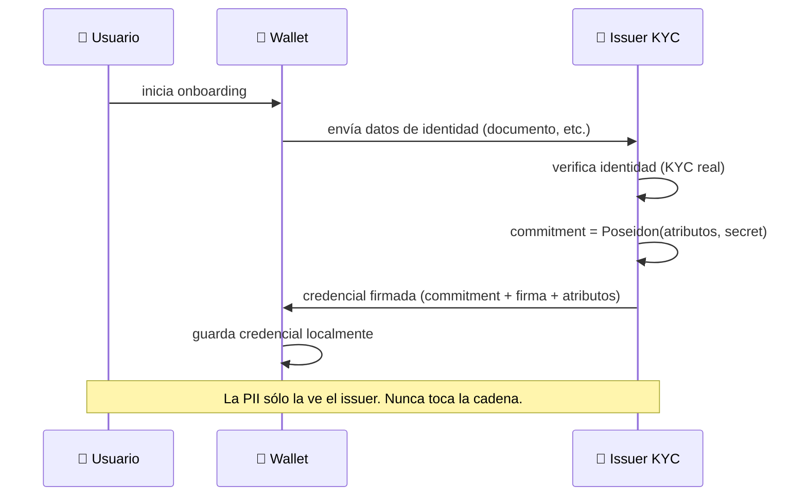
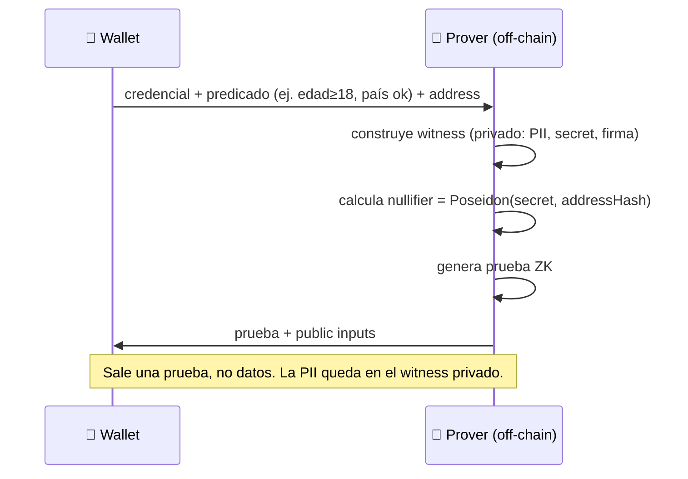
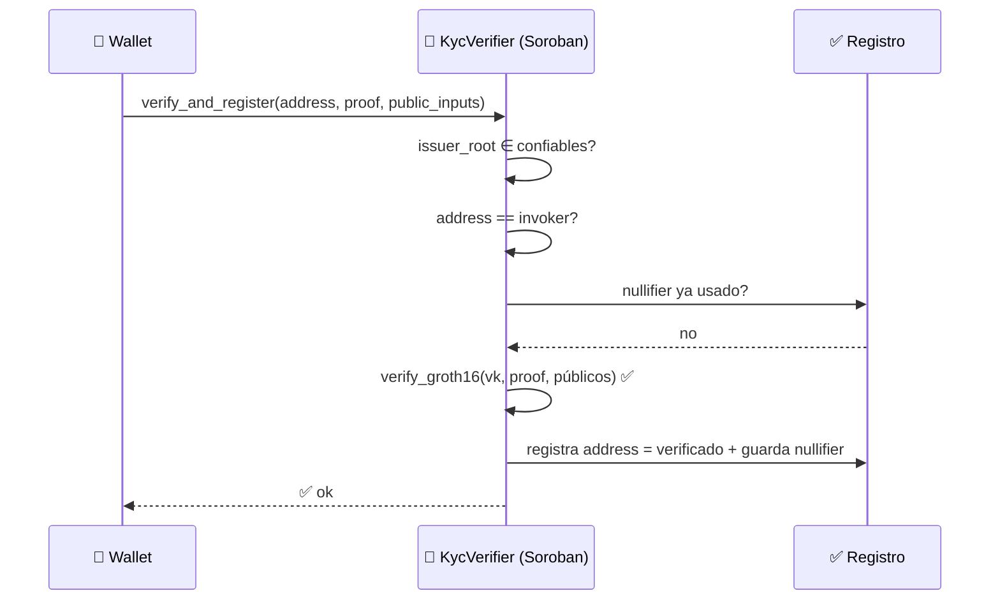
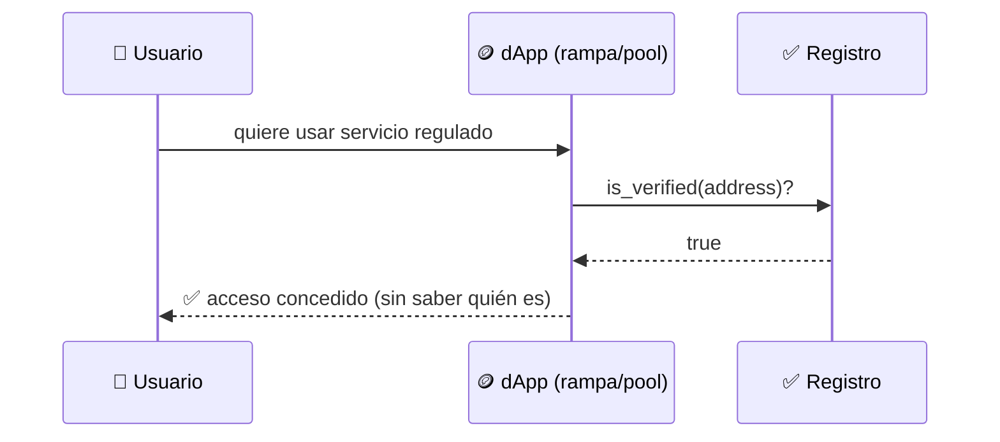
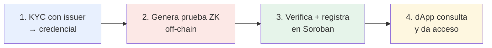

# Flujo de KYC

El recorrido completo, paso a paso, desde que el usuario verifica su identidad hasta que
una dApp confía en él. Componentes en [[Arquitectura General]].

## Fase 1 — Emisión de la credencial (una sola vez)

## Fase 2 — Generación de la prueba (cada vez que hace falta)

## Fase 3 — Verificación y registro on-chain

## Fase 4 — Consumo por una dApp

## Flujo completo de un vistazo

## Notas de seguridad del flujo

- **Address binding (paso 3):** la prueba está atada al `addressHash`; el contrato exige
  que el invoker sea ese address → nadie puede comprar/reutilizar la prueba de otro.
- **Nullifier (paso 3):** evita doble registro y ataques sybil sin revelar identidad.
- **Issuer root (paso 3):** sólo se aceptan credenciales de issuers de confianza.
- La **PII nunca sale del cliente** salvo hacia el issuer en la Fase 1.

Detalle criptográfico en [[Diseño del Circuito ZK]] y [[Modelo de Datos]].
