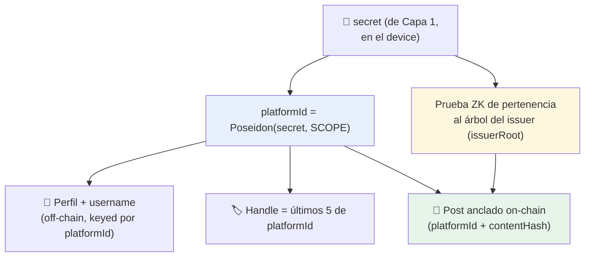

---
tags:
  - arquitectura
  - capa/2-plataforma
  - anonimato
---

# Identidad anónima de plataforma (platformId)

El corazón ZK de la [[Plataforma de Opinión Verificada|Capa 2]]: cómo una persona participa
de forma **anónima pero responsable** sin que nada la conecte con su KYC.

> **En una frase:** en la plataforma no sos tu address del KYC — sos tu `platformId`, un
> seudónimo derivado de tu `secret` por una función unidireccional, imposible de revertir.

---

## El problema que resuelve

Si en la plataforma posteás con el **address verificado** del KYC, cualquiera puede:

- linkear tu opinión a la transacción `verify_and_register` de tu KYC,
- y desde ahí a todo tu historial on-chain.

Eso es **seudónimo, no anónimo**. La Capa 2 lo evita separando por completo la identidad de
KYC (address) de la identidad de plataforma (`platformId`).

---

## La construcción

| Propiedad | Cómo se logra |
|---|---|
| **Anónimo** (sin PII ni address) | `platformId = Poseidon(secret, SCOPE)`. Poseidon es unidireccional → no se vuelve al secret/address/PII. |
| **Persistente** (perfil, reputación) | Determinístico: mismo `secret` + mismo `SCOPE` → mismo `platformId` siempre. |
| **Único por humano** (anti-Sybil) | Un humano tiene un `secret` (de Capa 1) → un `platformId`. No puede fabricar otra identidad. |
| **Verificado** (solo humanos reales) | Cada acción lleva una prueba ZK de **pertenencia al árbol del issuer** (`issuerRoot`), el mismo set de humanos validados en Capa 1. |
| **Atado al contenido** (anti-replay) | El `contentHash` va dentro de la prueba; cambiar el texto la invalida. |

---

## El puente entre capas (versión anónima)

La Capa 2 **no usa `is_verified(address)`** — eso forzaría a actuar como el address y
deanonimizaría. El puente ZK-fiel es el **`issuerRoot`** (la raíz Merkle del set de humanos
verificados de Capa 1):

- El contrato `opinion_board` guarda el `issuerRoot` de confianza (el mismo de Capa 1).
- Cada prueba demuestra "mi commitment está en ese árbol" sin revelar cuál.
- Así, "solo humanos únicos verificados pueden participar" se mantiene **sin tocar el address**.

> Comparar con [[Arquitectura General#Los dos puentes entre capas]]: `is_verified(address)`
> sirve para dApps genéricas (rampas, pools); la plataforma anónima usa pertenencia a
> `issuerRoot`.

---

## Por qué la cuenta efímera

Aunque el post no use el address del KYC, **alguien tiene que pagar el fee** de la
transacción on-chain. Si lo paga el address del KYC, ese fee-payer te delata.

**Solución implementada:** una **cuenta efímera** generada al vuelo y fondeada con friendbot
(testnet), sin relación con el KYC. Rompe el link `address-KYC ↔ actividad de plataforma`.

- En testnet: friendbot.
- En producción: un **relayer** (servicio que paga fees por pruebas válidas) o meta-tx.

---

## Anti-Sybil resistente a evasión

Como `platformId` es determinístico por humano, **no se puede evadir un baneo creando otra
identidad**: el mismo `secret` siempre produce el mismo `platformId`. Esto hace que la
moderación futura ([[Curaduría y Agentes Validadores]]) pueda banear un seudónimo de forma
efectiva **sin** saber quién es la persona.

---

## El `SCOPE`

`platformId = Poseidon(secret, SCOPE)` donde `SCOPE` es una constante del dominio human.

- Con un `SCOPE` distinto se derivan **identidades incorrelacionables** entre contextos
  (ej. otra app, otro foro) — la misma persona tendría seudónimos distintos y no linkeables.
- Para esta primera iteración hay un solo `SCOPE` (la plataforma de opinión).

---

## Fugas conocidas (honestidad criptográfica)

- **Correlación por timing:** registrar el KYC y aparecer en la plataforma poco después puede
  correlacionarse. Mitigación futura: delays / mixing.
- **`SCOPE` único:** toda la actividad bajo el mismo scope es linkeable entre sí (por diseño:
  habilita reputación). Es seudonimato *dentro* de la plataforma, anónimo *hacia afuera*.

---

Relacionado: [[Implementación Capa 2 (plataforma)]], [[Identidad Pública vs Anónima]],
[[Plataforma de Opinión Verificada]], [[Diseño del Circuito ZK]], [[Decisiones técnicas y trade-offs]].
