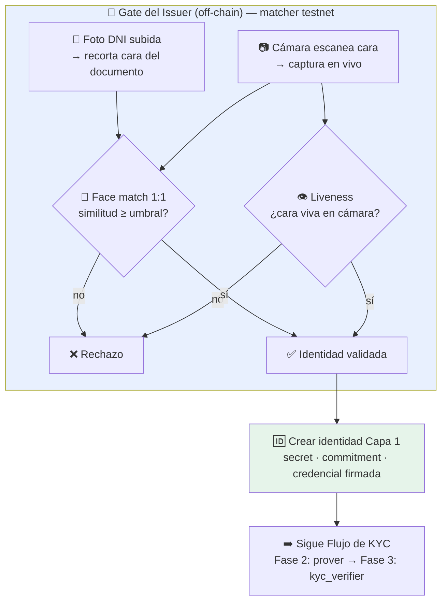
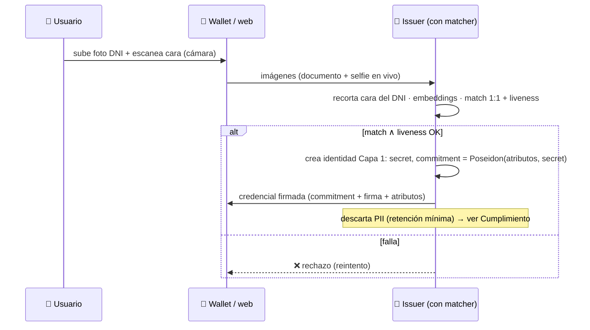

# Matcher de Identidad (Gate de Capa 1)

Dónde encaja el **matcher de cara** dentro de la arquitectura: es el paso que convierte el
`verifica identidad (KYC real)` de la [[Flujo de KYC|Fase 1]] (hoy **mock**) en una
verificación **real** para testnet, **antes** de que el issuer cree la identidad de Capa 1.

> [!info] Idea en una línea
> El usuario **sube la foto de su DNI** y **escanea su cara con la cámara**. Si la cara del
> DNI y la cara en vivo **coinciden**, recién ahí el issuer genera la **credencial +
> commitment** (la identidad de Capa 1) y sigue todo el flujo ZK que ya está diseñado.

## Por qué existe este gate

En [[Arquitectura General]] la Capa 1 es *Issuer → Prover → kyc_verifier → Registro*. El
issuer arranca como **mock** (firma cualquier cosa). El **matcher es lo que le da realness**
al issuer sin salir de testnet: garantiza que detrás del commitment hubo una persona cuya
cara coincide con su documento.

Es la versión **testnet** del KYC real. La versión **producción** reemplaza el matcher por
**RENAPER / SID** (validación contra el Estado) **sin tocar el resto** — ver
[[Proveedores-y-Stack]] y la interfaz `IdentityProvider` en [[Puente-KYC-a-ZK]].

## Las dos validaciones (ambas deben pasar)

1. **Face match (1:1)** — la cara recortada del DNI vs la cara en vivo de la cámara. Un
   modelo genera *embeddings* y mide similitud; si supera el umbral → match. Es real, no
   mock (el modelo de verdad compara).
2. **Liveness** — la cara llega de un **escaneo en vivo por cámara**, no de una foto
   estática subida. Para testnet alcanza con la captura por cámara (+ challenge simple
   opcional). Detalle de niveles en [[Biometria-y-Liveness]].

## Cómo modifica la Fase 1 del flujo

La [[Flujo de KYC]] Fase 1 hoy dice `I->>I: verifica identidad (KYC real)`. El matcher **es**
ese paso. Queda así:

## Límite honesto (importante para no engañarse)

Como la foto de referencia la **aporta el usuario** (su DNI), el matcher prueba *"quien se
saca el selfie es la cara del documento presentado"*, **no** que el DNI sea auténtico o que
esa persona exista. **Para testnet está perfecto.** La autenticidad real del documento
llega con **RENAPER** en producción (ver [[Verificacion-DNI-Argentina]]).

## Encaje con las capas

- No cambia la **Capa ZK** ni el **contrato** ([[Contrato Verificador (Soroban)]]): el gate
  vive **antes** del commitment.
- No cambia el **Modelo de Datos** on-chain: sigue siendo `Verified(address)` + nullifiers
  ([[Modelo de Datos]]).
- Solo **reemplaza el "cómo" del issuer verifica**: de mock → matcher real (testnet).

## Spec de implementación para el agente
→ [[Spec — Matcher DNI + Selfie (Capa 1)]] (qué construir y qué archivos toca).

Relacionado: [[Flujo de KYC]] · [[Arquitectura General]] · [[Biometria-y-Liveness]] · [[Puente-KYC-a-ZK]] · [[Proveedores-y-Stack]]
