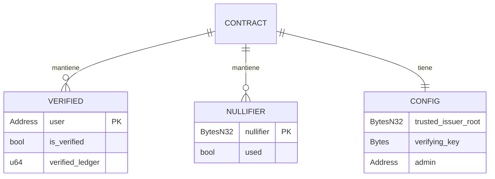
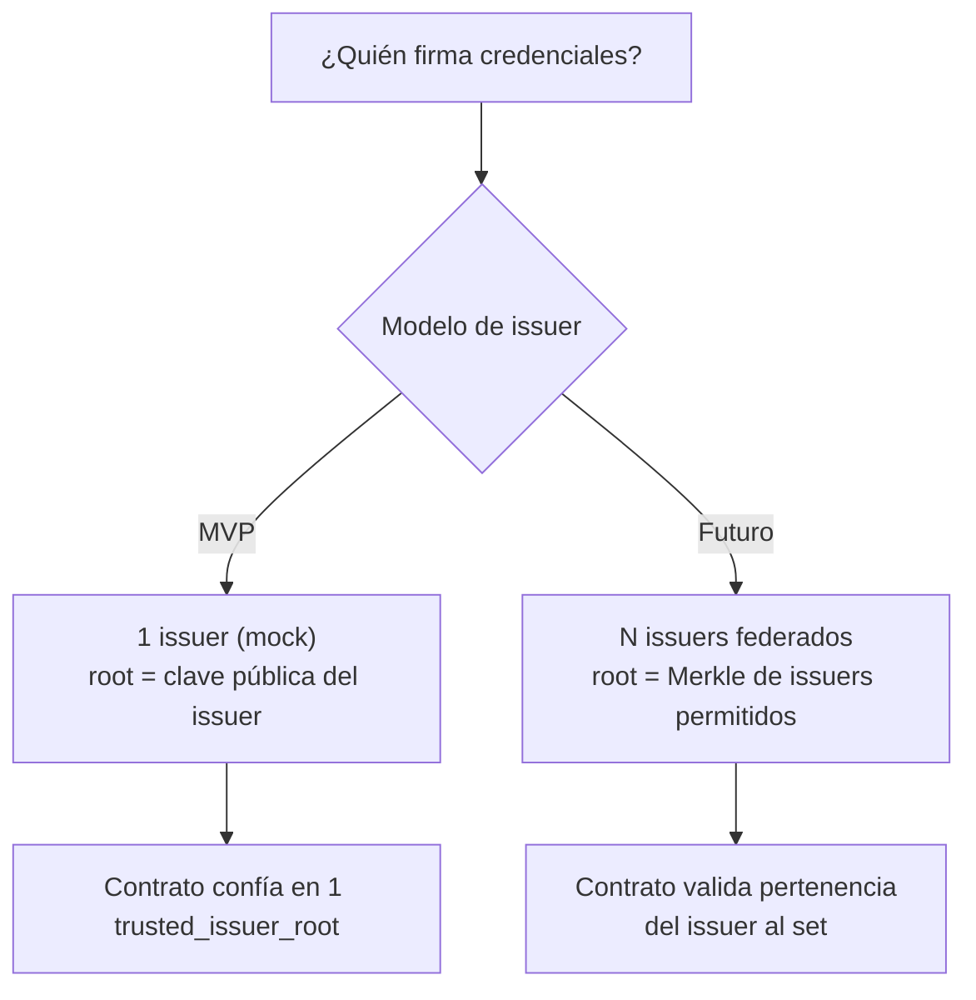

# Modelo de Datos

Estructuras de datos que viven en cada capa: la credencial off-chain y el estado on-chain.

## La credencial KYC (off-chain)

Lo que el [[Arquitectura General|issuer]] emite y la wallet guarda:

```json
{
  "version": 1,
  "issuer_id": "did:stellar:G...ISSUER",
  "attributes": {
    "birth_year": 1995,
    "country_code": "AR",
    "kyc_level": 2
  },
  "secret": "0x<random_field_element>",
  "commitment": "0x<poseidon(birth_year, country_code, secret)>",
  "issuer_signature": "0x<firma del issuer sobre el commitment>",
  "issued_at": "2026-06-22T00:00:00Z"
}
```

- `attributes` + `secret` son **privados** (nunca salen del cliente).
- `commitment` y `issuer_signature` son lo que prueba la pertenencia al issuer.
- En el MVP el issuer es un **mock** que firma con una clave de prueba (declarado en
  README).

## Estado on-chain (Soroban storage)

Lo que mantiene el [[Contrato Verificador (Soroban)]]:



| Clave de storage | Tipo | Storage | Contenido |
|---|---|---|---|
| `Config` | struct | Instance | issuer root de confianza, VK, admin |
| `Verified(address)` | bool | Persistent | si el address pasó KYC |
| `Nullifier(n)` | bool | Persistent | nullifiers ya consumidos (anti-replay) |

> ⚠️ Recordar el **state archival / TTL** de Soroban: las entradas `Persistent` requieren
> renovar TTL o documentar su expiración. → [[Stellar y Soroban]]

## Modelo de confianza



- **MVP:** un único issuer de confianza, cuya clave pública es `trusted_issuer_root`.
- **Futuro:** federación de issuers (gobernanza sobre qué issuers se aceptan), revocación
  de credenciales, recuperación.

## Qué NO se guarda nunca on-chain

- ❌ Nombre, documento, fecha de nacimiento, país concreto.
- ❌ El commitment crudo o la firma del issuer (no hace falta: viven en el witness).
- ✅ Sólo: *este address está verificado* + nullifiers consumidos.

Relacionado: [[Diseño del Circuito ZK]] · [[Contrato Verificador (Soroban)]] · [[Problema y Solucion]]
