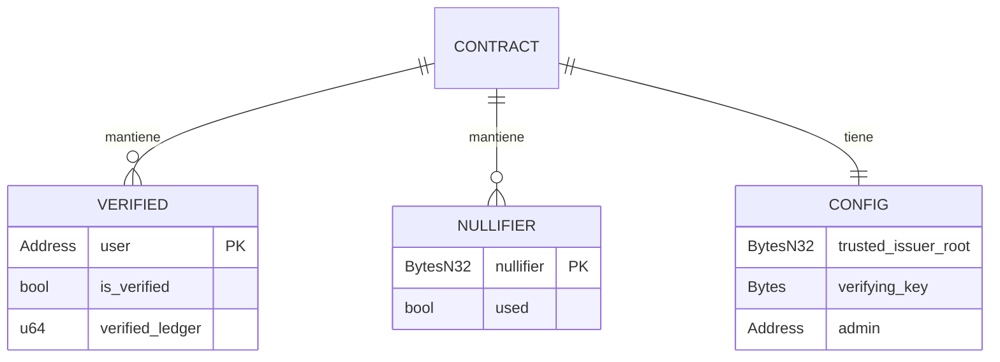
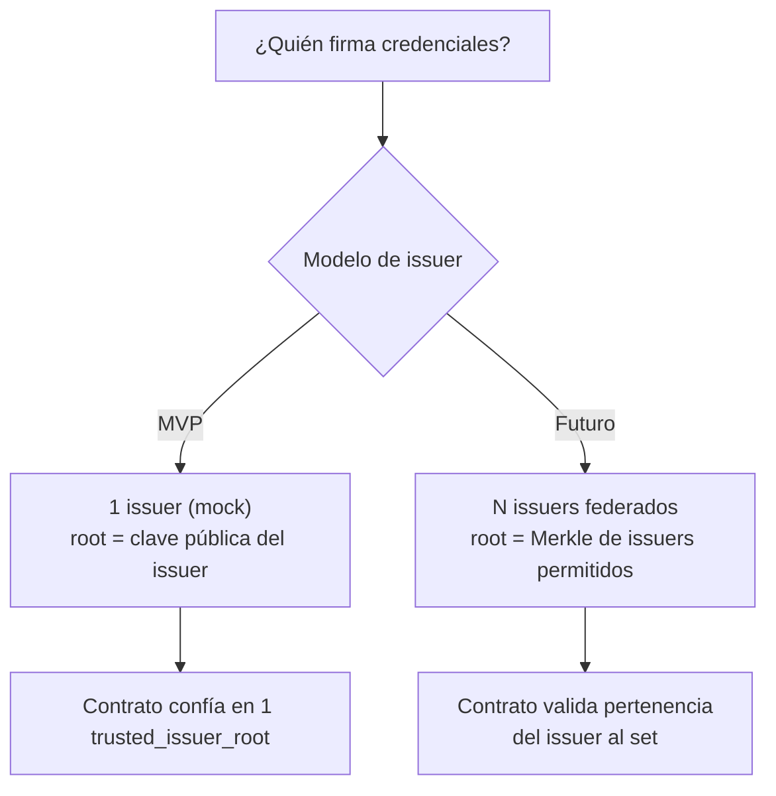

# Modelo de Datos

Estructuras de datos que viven en cada capa: la credencial off-chain y el estado on-chain.

## La credencial KYC (off-chain) — `Capa1Credential`

Lo que el [[Arquitectura General|issuer]] emite (tras pasar el gate del matcher) y la wallet
guarda. Estructura en `packages/shared/src/index.ts`:

```typescript
interface Capa1Credential {
  attributes: IdentityAttributes;      // { birthYear, countryCode (ISO 3166-1 numérico) }
  secret: string;                       // elemento de campo (decimal), generado en el device
  commitment: string;                   // Poseidon(birthYear, countryCode, secret)
  issuerRoot: string;                   // raíz Merkle del árbol de credenciales
  pathElements: string[];               // hermanos del Merkle path
  pathIndices: number[];                // 0/1 por nivel
}
```

- **Atributos:** `birthYear` (para edad), `countryCode` (ISO numérico, ej. AR=32). **Privados:**
  nunca salen del cliente.
- **Secret:** elemento de campo (generado en el device, el usuario lo guarda). Determinístico
  (no random): mejora reproducibilidad.
- **Commitment:** `Poseidon(birthYear, countryCode, secret)`. Es la "semilla" de la identidad.
- **Merkle proof:** (issuerRoot, pathElements, pathIndices) prueba que el commitment pertenece
  al árbol del issuer.
- En el MVP el issuer es un **mock** (face-api local); en producción será RENAPER/SID.

**Flujo:** usuario pasa gate (DNI + cara) → enroll → issuer crea Capa1Credential → se guarda
en device → se usa para generar prueba.

Relacionado: [[Matcher de Identidad (Gate de Capa 1)]] (de-dup, `DEDUP_PEPPER`),
[[Implementación en rama kyc-zk#4. SDK Cliente]].

## Estado on-chain (Soroban storage)

Lo que mantiene el [[Contrato Verificador (Soroban)]]:



| Clave de storage | Tipo | Storage | Contenido |
|---|---|---|---|
| `Config` | struct | Instance | issuer root de confianza, VK, admin |
| `Verified(address)` | bool | Persistent | si el address pasó KYC |
| `Nullifier(n)` | bool | Persistent | nullifiers ya consumidos (anti-replay) |

> ⚠️ Recordar el **state archival / TTL** de Soroban: las entradas `Persistent` requieren
> renovar TTL o documentar su expiración. → [[Stellar y Soroban]]

## Modelo de confianza



- **MVP:** un único issuer de confianza, cuya clave pública es `trusted_issuer_root`.
- **Futuro:** federación de issuers (gobernanza sobre qué issuers se aceptan), revocación
  de credenciales, recuperación.

## Qué NO se guarda nunca on-chain

- ❌ Nombre, documento, fecha de nacimiento, país concreto.
- ❌ El commitment crudo o las imágenes (no hace falta: viven en el witness).
- ✅ Sólo: *este address está verificado* + nullifiers consumidos.

---

## Implementación (rama `kyc-zk`)

Código real en:

- **Capa1Credential:** `packages/shared/src/index.ts` (tipos TS).
- **Generación:** `identity/issuer/` (matcher valida DNI+cara → enroll genera Capa1Credential).
- **Circuito:** `identity/circuits/src/kyc.circom` (consume Capa1Credential en el witness).
- **On-chain storage:** `identity/contracts/kyc_verifier/src/lib.rs` (Verified map + Nullifier set).
- **Testdata:** `identity/contracts/kyc_verifier/src/testdata.rs` (snapshot para tests).

Detalles en [[Implementación en rama kyc-zk]].

---

## Modelo de datos de la CAPA 2 (plataforma)

La plataforma **no usa el address**: la clave de todo es el `platformId` (seudónimo anónimo).
Detalle en [[Identidad anónima de plataforma (platformId)]].

### On-chain (`opinion_board`)

| Clave de storage | Tipo | Contenido |
|---|---|---|
| `Config` | struct | admin + `trusted_issuer_root` (la raíz del issuer de Capa 1) |
| `Vk` | VerificationKey | VK del circuito de plataforma |
| `Identity(platformId)` | bool | identidades anónimas registradas |
| `Post(id)` | PostRecord | `{ platformId, content_hash, timestamp }` |
| `PostCount` | u64 | contador de posts |
| `Posted(platformId, content_hash)` | bool | anti-replay (un contenido por identidad) |

**Public signals de la prueba:** `[issuerRoot, platformId, contentHash]`.

### Off-chain (`platform/api`, store keyed por platformId)

```typescript
interface Profile { username: string; handle: string; }   // handle = últimos 5 de platformId
interface PostItem {
  platformId: string;       // seudónimo anónimo (NO address)
  handle: string;
  username: string;
  content: string;          // el texto del post
  contentHash: string;      // coincide con el anclado on-chain
  txHash: string;           // tx del ancla (cuenta efímera, sin address KYC)
  ts: number;
}
```

### Qué NO se guarda nunca (Capa 2)

- ❌ El address del KYC (en ningún lado de la plataforma).
- ❌ PII, nombre, documento.
- ✅ Sólo: `platformId`, username libre, contenido, hashes.

Detalles en [[Implementación Capa 2 (plataforma)]].

Relacionado: [[Diseño del Circuito ZK]] · [[Contrato Verificador (Soroban)]] ·
[[Matcher de Identidad (Gate de Capa 1)]] · [[Identidad anónima de plataforma (platformId)]]
