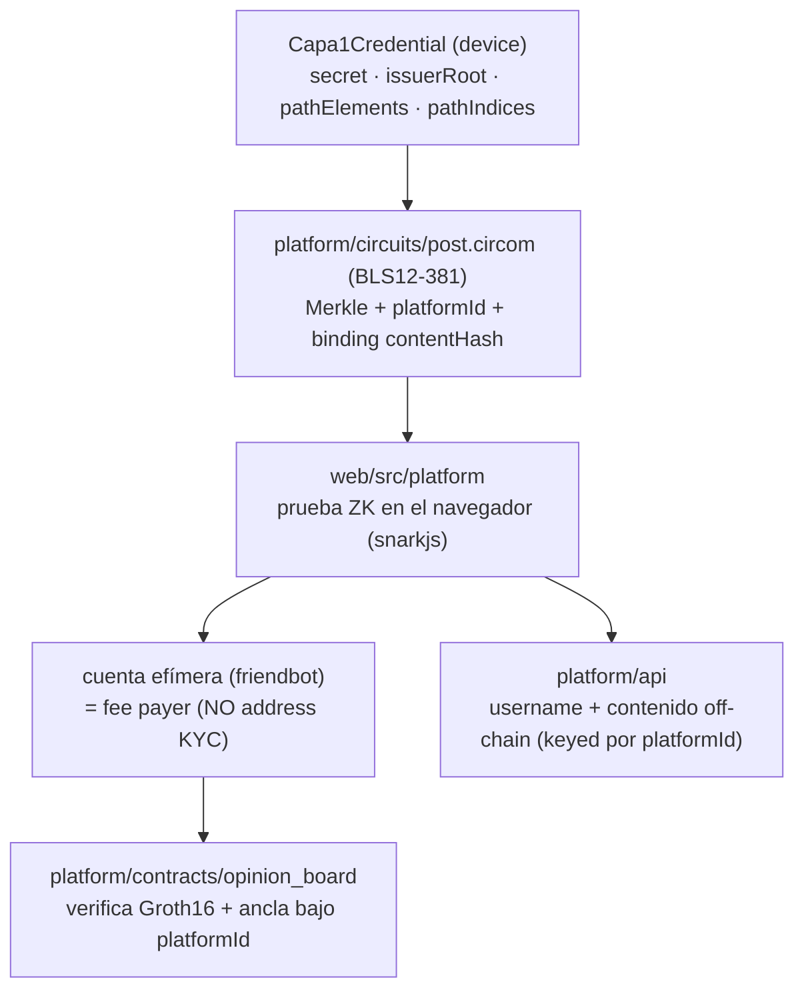
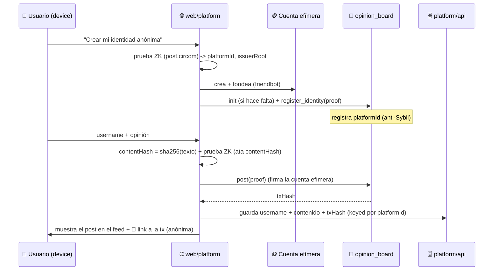

---
tags:
  - implementacion
  - capa/2-plataforma
  - estado/implementado
---

# Capa 2 — Plataforma de Opinión (implementación y uso)

Cómo está construida y cómo se usa la **CAPA 2** de human: la plataforma de opinión donde
personas verificadas participan de forma **anónima por ZK**. Concepto en
[[Plataforma de Opinión Verificada]] y [[Identidad Pública vs Anónima]]; decisiones en
[[Decisiones técnicas y trade-offs]].

> 🔑 **Regla suprema:** todo es anónimo por ZK. El address del KYC (Capa 1) **nunca** se usa
> ni se revela en la plataforma. Lo único que cruza a la cadena: `platformId`, `proof`,
> `contentHash`. Cero PII.

---

## 1. Idea en una línea

Tu identidad de Capa 1 (un `secret` que pasó la [[Prueba de Persona Única]]) se transforma,
sin revelar nada, en una **identidad de plataforma anónima y persistente**:

```
platformId = Poseidon(secret, scope)
```

- **Determinística** → siempre la misma para vos (perfil persistente, reputación).
- **Única por humano** → anti-Sybil (no podés fabricarte varias).
- **Incorrelacionable** → de `platformId` es imposible volver a tu `secret`, address o PII
  (Poseidon es unidireccional).

---

## 2. Qué se puede hacer (esta iteración)

1. **Crear identidad anónima**: registrás tu `platformId` on-chain probando con ZK que
   pertenecés al árbol del issuer (Capa 1). Es siempre la misma identidad (ver §6).
2. **Perfil + username**: username libre (mutable, sin unicidad), off-chain, keyed por
   `platformId`.
3. **Handle público**: los **últimos 5 caracteres** del `platformId`.
4. **Postear**: una opinión gateada por una prueba ZK; contenido off-chain + ancla on-chain.
5. **Feed**: lista de posts por seudónimo, cada uno con **link a su transacción** on-chain.

---

## 3. Invariantes ZK (cómo se cumplen)

| Invariante | Implementación |
|---|---|
| El address del KYC nunca se usa/revela | La identidad es `platformId`. El contrato `opinion_board` **no tiene `Address`**. El fee on-chain lo paga una **cuenta efímera** (friendbot), no la wallet del KYC. |
| `platformId = Poseidon(secret, scope)` | Es output del circuito de plataforma; determinístico, único, unidireccional. |
| Gate por **pertenencia Merkle** (no `is_verified(address)`) | El circuito prueba inclusión del commitment bajo `issuerRoot`; el contrato exige `issuerRoot` de confianza. Reutiliza la `Capa1Credential` del device. |
| El post ata `contentHash` (anti-replay) | `contentHash` es public input *bound* en el circuito; el contrato rechaza `(platformId, contentHash)` repetido. |
| Fee payer ≠ address del KYC | Cuenta efímera aleatoria fondeada por friendbot firma las tx. |

**Anti-Sybil (doble candado):** el `platformId` determinístico + el contrato rechaza
registrar un `platformId` que ya existe.

---

## 4. Arquitectura (sobre los stubs; **no** se tocó `identity/`)



| Pieza | Ruta | Qué hace |
|---|---|---|
| Circuito | `platform/circuits/src/post.circom` | Prueba inclusión Merkle del commitment bajo `issuerRoot` + `platformId = Poseidon(secret, scope)` + binding de `contentHash`. Reutiliza los templates Poseidon/Merkle de [[Diseño del Circuito ZK\|Capa 1]] (misma curva BLS12-381). Public signals: `[issuerRoot, platformId, contentHash]`. |
| Contrato | `platform/contracts/opinion_board` | Verifica Groth16 (mismo patrón que el `kyc_verifier`), guarda el `issuerRoot` de confianza, y expone `init / register_identity / post / is_registered / get_post`. Ancla `PostRecord { platform_id, content_hash, timestamp }`. **Cero address**. |
| Backend | `platform/api` | Perfil (username) + contenido del post + feed, **keyed por `platformId`**. JSON store, cero PII/address. |
| Frontend | `web/src/platform` | Genera la prueba en el navegador (snarkjs), crea/fondea la cuenta efímera, firma e invoca el contrato, y guarda el contenido en el backend. **No usa wallet como identidad.** |

---

## 5. Flujo de uso (paso a paso, desde el front)

> Requisito: tener una identidad de **Capa 1** validada en el device (su `Capa1Credential`
> queda en `localStorage`). Si no, validarse primero en "Validar mi identidad".



- El **handle** que ves (`@xxxxx`) son los últimos 5 del `platformId`.
- Cada post muestra el **link a su transacción**: al abrirlo en el explorador, el *source*
  es la **cuenta efímera** (no tu address), y la operación ancla bajo `platformId`. Eso
  **demuestra que es anónimo**.

---

## 6. ¿Creo una identidad nueva cada vez? → No

`platformId = Poseidon(secret, scope)` con `secret` fijo (de Capa 1) y `scope` constante ⇒
**siempre el mismo `platformId`**. "Crear mi identidad anónima" en realidad **registra** esa
identidad determinística la primera vez; si ya estaba, el contrato responde
`AlreadyRegistered` y se reusa. Es a propósito: **1 humano = 1 identidad** (anti-Sybil),
anónima pero persistente.

> Si en el futuro quisiéramos seudónimos distintos por contexto (ej. uno por foro),
> alcanzaría con cambiar el `scope`: mismo humano, identidades incorrelacionables por
> contexto. Hoy hay un solo `scope` → una identidad global.

---

## 7. Por qué es imposible linkear `post ↔ address KYC ↔ PII`

- `platformId` es `Poseidon(secret, scope)`: **unidireccional** (no se invierte a `secret`).
- El `secret` **nunca sale del device** (no-custodial). On-chain sólo hay
  `platformId / contentHash / proof`.
- El **fee payer** es una cuenta efímera aleatoria, sin relación con el address del KYC.
- La prueba ZK demuestra pertenencia al árbol **sin revelar** qué commitment es el tuyo.

---

## 8. Cómo correrlo

```bash
# 1) Circuito de plataforma (una vez)
(cd platform/circuits && npm install && bash scripts/compile.sh && POWER=13 bash scripts/setup.sh)

# 2) Verificación on-chain por SDK (deploy + init + register + post) — probado en testnet
bash scripts/deploy_platform.sh
CONTRACT_ID=<id> SIGNER_SECRET=<secret efímero> \
  RPC_URL=https://soroban-testnet.stellar.org \
  NETWORK_PASSPHRASE="Test SDF Network ; September 2015" \
  npx tsx scripts/e2e-platform.ts

# 3) Demo desde el FRONT
bash scripts/deploy_platform.sh         # -> poné VITE_OPINION_BOARD_CONTRACT_ID=<id> en .env
npm run serve -w @behuman/api           # backend plataforma :8788
npm run dev   -w @behuman/web           # front :5173 -> "Plataforma de opinión (anónima)"
```

**Tests:** `cargo test -p opinion_board` (9/9: verify, register, anti-Sybil, post,
anti-replay, init). El `kyc_verifier` de Capa 1 queda intacto.

---

## 9. Contratos desplegados (testnet)

- `opinion_board` (e2e, init incluido): `CD2XVZTQTQZL3LU4E6PH7EXDGV2VX6KNAN2L3TROKJAR6U45SC2K2T6M`
- `opinion_board` (demo front, init desde el front): `CAZOMMMZSKI2EHH6PHP53NJ3K4DGAJ4JBRAR4HPVNN2QJ4VIF7WJKOQK`

> ⚠️ `trusted_issuer_root` se fija en `init` ⇒ **un contrato por demo** (mismo límite que
> Capa 1; raíz incremental = trabajo futuro).

---

## 10. Próximos pasos (no en esta iteración)

- **Curaduría** (`platform/curation`): agentes validadores (IA) + moderación →
  [[Curaduría y Agentes Validadores]].
- Unicidad de username, **modo público** opt-in ([[Identidad Pública vs Anónima]]),
  lectura sólo para verificados.
- Relayer en vez de cuenta efímera; raíz del issuer incremental.

Relacionado: [[Plataforma de Opinión Verificada]] · [[Identidad Pública vs Anónima]] ·
[[Prueba de Persona Única]] · [[Diseño del Circuito ZK]] · [[Decisiones técnicas y trade-offs]] ·
[[Stack de Privacidad en Stellar]]
