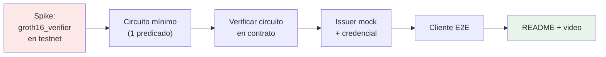

# Roadmap

Plan de ataque hasta el deadline (**29 jun, 12:00 PM PST** — ver [[Fechas Clave]]). Hoy
es **2026-06-22**: ~7 días.

## Estrategia

Reducir riesgo primero: validar que **podemos verificar una prueba en Soroban** antes de
construir el circuito completo. *Walking skeleton* end-to-end lo antes posible, luego
engordar la lógica.

## Fases

### Fase 0 — Decisiones (22 jun)
- [ ] Confirmar toolchain ZK (spike de `groth16_verifier`) → [[Comparativa de Herramientas ZK]]
- [ ] Cerrar interfaz de public inputs circuito↔contrato → [[Diseño del Circuito ZK]]
- [ ] Decidir nombre del proyecto → [[Vision General#Ideas de nombre]]

### Fase 1 — Walking skeleton (23-24 jun)
- [ ] Desplegar el `groth16_verifier` de ejemplo en testnet y verificar una prueba dummy
- [ ] Circuito mínimo: sólo `edad ≥ 18` con commitment Poseidon
- [ ] Trusted setup + generar/verificar prueba off-chain (snarkjs)

### Fase 2 — Integración (24-26 jun)
- [ ] Adaptar contrato a nuestros public inputs + storage `Verified`/`Nullifier`
- [ ] Verificar **nuestra** prueba dentro del contrato en testnet
- [ ] Issuer mock que firma credenciales → [[Modelo de Datos]]
- [ ] Añadir predicado de país + nullifier + address binding

### Fase 3 — End-to-end (26-27 jun)
- [ ] Cliente que orquesta: credencial → prueba → `verify_and_register` → `is_verified`
- [ ] dApp consumidora mínima que consulta el registro → [[Casos de Uso]]
- [ ] Script `e2e_demo.sh` reproducible

### Fase 4 — Entrega (28-29 jun)
- [ ] README claro (qué es, qué hace el ZK, qué es mock) → [[Reglas y Requisitos]]
- [ ] Video 2-3 min → [[Plan de Demo]]
- [ ] Repo público + submission **antes** de las 12:00 PM PST (con buffer)

## Riesgos y mitigaciones

| Riesgo | Mitigación |
|---|---|
| El verificador comunitario/oficial no compila o es complejo | Spike día 0; Groth16 oficial = menor riesgo |
| Trusted setup de Groth16 se complica | Usar setup pequeño/dev; documentar como dev-only |
| Circuito crece demasiado (lista de países) | Empezar con 1 predicado; país como extensión |
| Falta de tiempo | El MVP es 1 predicado E2E; lo demás es *future work* declarado |

## Definición de "MVP listo"

Un usuario, con una credencial mock, genera una prueba de `edad ≥ 18`, el contrato Soroban
la verifica en **testnet** y marca su address como verificado, y una consulta
`is_verified` lo confirma — **todo reproducible con un script** y grabado en video.

Relacionado: [[Fechas Clave]] · [[Plan de Demo]] · [[Estructura del Codigo]]
