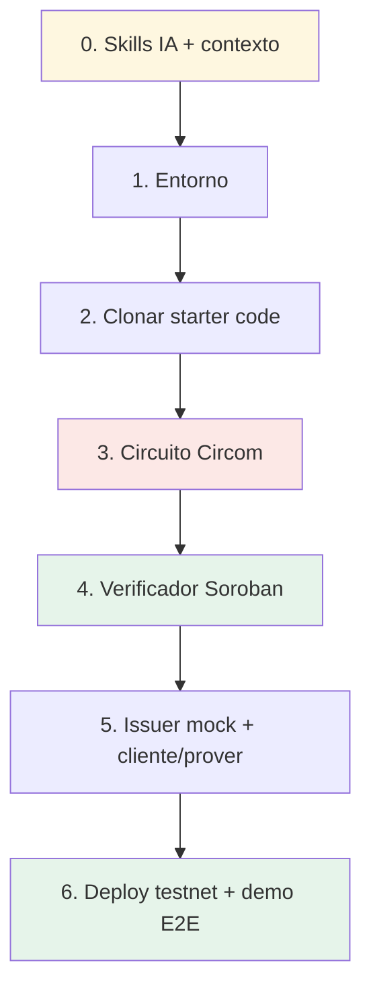

---
tags:
  - tools
---

# Plan de armado con IA

Receta **paso a paso** para construir el MVP del [[IDEA|KYC-ZK]] con un agente de IA,
encadenando todo lo de [[🧰 Tools — Índice]]. Es la nota operativa: "abre esto y empieza".

> Complementa (no reemplaza) [[Roadmap]] (qué hacemos por día) y [[Estructura del Codigo]]
> (dónde vive cada archivo). Aquí está **el cómo, con herramientas y prompts**.

---

## Paso 0 — Cargar contexto en el agente

1. Instala las skills → [[Skills de IA para construir]]:
   ```bash
   /plugin marketplace add stellar/stellar-dev-skill
   /plugin install stellar-dev@stellar-dev
   /plugin marketplace add OpenZeppelin/openzeppelin-skills
   /plugin install openzeppelin-skills
   ```
2. Dile: **"Read skills.stellar.org before you start building on Stellar"**, en especial la
   skill **zk-proofs** (Groth16 / BN254 / Poseidon).
3. Pásale el contexto de producto: [[IDEA]], [[Plano del KYC inspirado en zkMe]],
   [[Flujo de KYC]], [[Diseño del Circuito ZK]], [[Modelo de Datos]].

## Paso 1 — Entorno

Sigue [[Setup del Entorno]]: Rust + `wasm32-unknown-unknown`, Stellar CLI, identidad de
testnet fondeada, `circom` + `snarkjs`. Verifica con `stellar --version`.

## Paso 2 — Estudiar el starter code

Clona y lee, **no copies a ciegas** ([[Verificadores ZK de referencia]]):

```bash
git clone https://github.com/stellar/soroban-examples            # groth16_verifier (MVP)
git clone https://github.com/NethermindEth/stellar-private-payments  # patrón commitment+nullifier+ASP
```

El segundo (Privacy Pools PoC) es el **esqueleto más cercano** a nuestro KYC; el primero es
la base del verificador. ⚠️ El PoC **no está auditado**.

## Paso 3 — Circuito ZK (Circom)

Construir `circuits/kyc.circom` según [[Diseño del Circuito ZK]]:

- Inputs privados: atributos (PII), `secret`, firma del issuer.
- Públicos: `issuer_root`, `nullifier`, `addressHash`, predicado (edad≥18, país ok).
- Lógica: verifica firma/Merkle del issuer → evalúa predicados → expone
  `commitment` y `nullifier = Poseidon(secret, addressHash)`.

```bash
# compilar, trusted setup y prueba de ejemplo (ver scripts/ en Estructura del Codigo)
circom kyc.circom --r1cs --wasm --sym
snarkjs groth16 setup ...   # powers of tau + zkey
```

## Paso 4 — Contrato verificador (Soroban)

A partir de `groth16_verifier`, escribir [[Contrato Verificador (Soroban)]]:

- `verify_and_register(address, proof, public_inputs)`:
  1. `issuer_root ∈ confiables`,
  2. `address == invoker` (**address binding**),
  3. `nullifier` no usado antes,
  4. `verify_groth16(vk, proof, públicos)`,
  5. registrar `address = verificado` + guardar `nullifier`.
- `is_verified(address) -> bool` para que las dApps consulten.

Usar los **detectores de seguridad de OpenZeppelin** y los patrones de stellar-dev-skill.

## Paso 5 — Issuer mock + cliente/prover

- `issuer/` — firma credenciales de prueba (declarar **mock** en el README, lo pide la
  hackathon → [[Reglas y Requisitos]]).
- `client/` — orquesta: credencial → genera prueba (WASM en el navegador, secretos nunca
  salen) → arma la tx → llama al contrato. Patrón tomado del PoC de Privacy Pools.

## Paso 6 — Deploy + demo E2E

- `scripts/deploy_testnet.sh` y `scripts/e2e_demo.sh` (lo que graba el video).
- Validar el flujo completo de [[Flujo de KYC]] en testnet. Guion en [[Plan de Demo]].

---

## El flujo de construcción de un vistazo



## Checklist del MVP

- [ ] Skills cargadas y agente leyó skills.stellar.org
- [ ] Entorno verificado ([[Setup del Entorno]])
- [ ] `groth16_verifier` + Privacy Pools PoC clonados y entendidos
- [ ] Circuito `kyc.circom` compila y genera prueba de ejemplo
- [ ] Contrato `verify_and_register` + `is_verified` con tests
- [ ] Issuer mock firmando + cliente generando prueba en WASM
- [ ] Deploy en testnet + `e2e_demo.sh` corriendo de punta a punta
- [ ] Revisión humana de la cripto (nullifier / address binding / issuer root)

---

## Relacionado

- [[🧰 Tools — Índice]] · [[Skills de IA para construir]] · [[Verificadores ZK de referencia]]
- [[Roadmap]] · [[Estructura del Codigo]] · [[Plan de Demo]]
- [[Diseño del Circuito ZK]] · [[Contrato Verificador (Soroban)]] · [[Flujo de KYC]]
