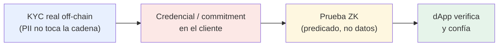

---
tags:
  - tools
  - capa/1-identidad
  - zk
---

# Plano del KYC inspirado en zkMe

[[zkME|zkMe]] es un **KYC con Zero-Knowledge** que ya funciona en otras blockchains, pero
**no está implementado en Stellar**. Es nuestra principal **referencia de producto**: lo
estudiamos para diseñar el nuestro desde cero. Esta nota destila *qué tomar* de zkMe y
*cómo lo bajamos* a Stellar/Soroban.

> 🌐 zkMe: https://www.zk.me/
> Nuestra ventaja: **ser los primeros en traer este patrón a Stellar** ([[IDEA]]).

---

## Qué hace zkMe (el patrón a imitar)

A grandes rasgos, zkMe resuelve **identidad verificada sin exponer datos**:

1. **Verificación off-chain** de identidad real (documento, prueba de vida) contra un
   proveedor/issuer. La **PII (datos personales)** se queda fuera de la cadena.
2. **Credencial / commitment** que representa "esta persona pasó KYC", guardada del lado del
   usuario.
3. **Prueba ZK** que demuestra a una dApp que cumples un predicado (eres persona única,
   eres mayor de edad, eres de un país permitido…) **sin revelar quién eres**.
4. **Anti-sybil / proof of personhood**: un mecanismo para garantizar **una persona real =
   una identidad**, evitando bots y cuentas múltiples.
5. **Reutilizable**: validas una vez y pruebas muchas veces ante distintas dApps.

---

## Qué tomamos y qué cambiamos

| Pieza de zkMe | Cómo la implementamos en **nuestro** KYC sobre Stellar |
|---|---|
| Verificación KYC off-chain | **Issuer mock** que firma credenciales de prueba (`issuer/` en [[Estructura del Codigo]]). PII nunca on-chain — [[Flujo de KYC#Fase 1]]. |
| Credencial / commitment | `commitment = Poseidon(atributos, secret)` — [[Modelo de Datos]]. |
| Prueba ZK del predicado | Circuito **Circom + Groth16** que prueba edad/país/firma — [[Diseño del Circuito ZK]]. |
| Proof of personhood (anti-sybil) | **`nullifier = Poseidon(secret, addressHash)`** registrado on-chain → una persona = una identidad. [[Prueba de Persona Única]]. |
| Verificación on-chain | Contrato Soroban `verify_and_register(...)` — [[Contrato Verificador (Soroban)]], a partir del [[Verificadores ZK de referencia|Groth16 verifier oficial]]. |
| Reutilización ante dApps | `is_verified(address)` que cualquier dApp consulta — [[Flujo de KYC#Fase 4]]. |
| Lista de proveedores confiables | `issuer_root` ∈ confiables (patrón **ASP** de [[Stack de Privacidad en Stellar|Privacy Pools]]). |

> 🔑 **Diferenciador frente a zkMe:** además del KYC anónimo, encima construimos una
> [[Plataforma de Opinión Verificada|capa de opinión pública verificada]] con el equilibrio
> [[Identidad Pública vs Anónima|anonimato ↔ responsabilidad]]. zkMe es identidad; nosotros
> identidad **+ impacto social**.

---

## El "puente" difícil (igual que en zkMe)

El reto central de [[IDEA]] —validar a cada persona de forma **anónima pero única**— es el
mismo que resuelve zkMe con su proof of personhood. Nuestra respuesta:

- **Anónima** → la PII queda en el *witness* privado del circuito; sólo sale una prueba.
- **Única** → el **nullifier** determinístico por persona impide registrarse dos veces sin
  revelar identidad.

Detalle criptográfico en [[Diseño del Circuito ZK]] y riesgos en
[[Diseño del Circuito ZK#Riesgos / consideraciones]].

---

## Preguntas abiertas (heredadas de la idea)

- [ ] ¿Cómo ata zkMe el nullifier a la persona y no sólo a la wallet? (clave para que
      cambiar de wallet no cree una identidad nueva) → [[Prueba de Persona Única]].
- [ ] ¿Un solo issuer (como un proveedor zkMe) o federación de issuers? →
      [[Modelo de Datos]] y [[🏠 Home#❓ Decisiones abiertas]].
- [ ] ¿Revocación de credenciales al estilo zkMe? → [[Notas y Referencias]] (post-MVP).

---

## Relacionado

- [[zkME]] — la nota de investigación original.
- [[IDEA]] · [[Prueba de Persona Única]] · [[Plataforma de Opinión Verificada]]
- [[Flujo de KYC]] · [[Diseño del Circuito ZK]] · [[Modelo de Datos]]
- [[Plan de armado con IA]] — cómo construir este plano paso a paso.
