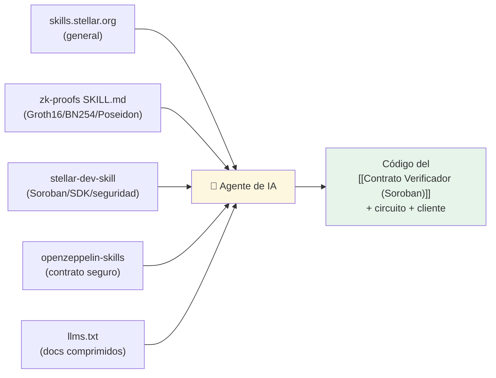

---
tags:
  - tools
---

# Skills de IA para construir

Vamos a **construir el KYC-ZK con un agente de IA**. La diferencia entre un agente que
escribe código Stellar mediocre y uno que escribe código correcto es **el contexto que le
das de entrada**. Esta nota reúne las *skills* oficiales y de la comunidad, qué cubre cada
una, y cómo instalarlas.

> 🎯 **Lo más importante, primero:** dile a tu agente
> **"Read skills.stellar.org before you start building on Stellar."**
> Es el consejo de la propia Stellar y es el de mayor impacto en la calidad del código.

---

## 1. Stellar Skills — el punto de partida

**https://skills.stellar.org/** — Documentación *agent-readable* para construir en Stellar.
Tiene skills dedicadas a **Soroban, dApps/wallets, assets, data/APIs, agentic payments y
ZK Proofs**. Funciona con cualquier agente de IA.

### ZK Proofs skill (la que más nos toca)
- Directo: https://skills.stellar.org/skills/zk-proofs/SKILL.md
- Cubre: **verificar pruebas Groth16** en Stellar usando **BLS12-381, BN254 y Poseidon**.
- Es exactamente la primitiva que usa nuestro [[Contrato Verificador (Soroban)]].

---

## 2. stellar-dev-skill (oficial, open-source)

**https://github.com/stellar/stellar-dev-skill** — El repo open-source detrás de las
skills. Cubre **Soroban, SDKs, RPC, integración de wallets, passkeys y patrones de
seguridad**.

**Instalar en Claude Code:**

```bash
/plugin marketplace add stellar/stellar-dev-skill
/plugin install stellar-dev@stellar-dev
```

**Cursor:** añadir `stellar/stellar-dev-skill`.

**Codex:**

```bash
git clone https://github.com/stellar/stellar-dev-skill ~/.codex/skills/stellar-dev-skill
```

---

## 3. stellar-build (kaankacar) — el viaje completo

**https://github.com/kaankacar/stellar-build** — Instalador de **42 skills** que cubren el
viaje completo: **de la idea al deploy en mainnet** y a la **submission de un grant SCF**,
con seis agentes con persona de DevRel.

> Útil para más que el código: nos ayuda con el **flow de producto** (idea → MVP → deploy →
> pitch) que necesitamos para la hackathon. Ver [[Roadmap]] y [[Plan de Demo]].

---

## 4. OpenZeppelin Skills — seguridad

**https://github.com/OpenZeppelin/openzeppelin-skills** — Skills para **desarrollo seguro
de contratos Stellar**. Crítico para un contrato que maneja identidad/verificación.

```bash
/plugin marketplace add OpenZeppelin/openzeppelin-skills
/plugin install openzeppelin-skills
```

Complementa: **OpenZeppelin on Stellar** (librería auditada + Contracts Wizard + detectores
de seguridad): https://www.openzeppelin.com/networks/stellar

---

## 5. Recursos base para alimentar a cualquier LLM

| Recurso | Enlace | Uso |
|---|---|---|
| Building with AI (docs) | https://developers.stellar.org/docs/build/building-with-ai | Guía oficial de desarrollo asistido por IA. |
| llms.txt | https://developers.stellar.org/llms.txt | Digest *machine-readable* de los docs; pégalo en el contexto del modelo. |

---

## Qué cargar para construir **nuestro** KYC-ZK



### Prompt de arranque sugerido para el agente

> "Vas a ayudarme a construir un **KYC con Zero-Knowledge sobre Stellar (Soroban)**.
> Antes de escribir código: **lee skills.stellar.org**, en particular la skill de
> **zk-proofs** (verificación Groth16 con BN254/Poseidon), y carga `llms.txt`. El objetivo
> es un contrato Soroban `verify_and_register(address, proof, public_inputs)` que verifique
> una prueba Groth16 y registre un `nullifier` para garantizar una persona = una identidad,
> sin exponer PII. Sigue los patrones de seguridad de stellar-dev-skill y OpenZeppelin."

Contexto de producto a darle: [[IDEA]], [[Flujo de KYC]], [[Diseño del Circuito ZK]],
[[Modelo de Datos]] y [[Plano del KYC inspirado en zkMe]].

---

## ⚠️ Verificación humana (no opcional)

Las skills mejoran el código, **no lo garantizan**. Todo lo que toque criptografía,
`nullifier`, *address binding* o lista de issuers confiables se **revisa a mano** y se
prueba (ver [[Diseño del Circuito ZK#Riesgos / consideraciones]] y los detectores de
seguridad de OpenZeppelin). El PoC de Privacy Pools no está auditado: sirve de patrón, no
se copia a ciegas.

---

## Relacionado

- [[🧰 Tools — Índice]] · [[Recursos ZK & Privacy en Stellar]] · [[Plan de armado con IA]]
- [[Verificadores ZK de referencia]] — el starter code que el agente debe estudiar.
- [[Contrato Verificador (Soroban)]] · [[Diseño del Circuito ZK]]
