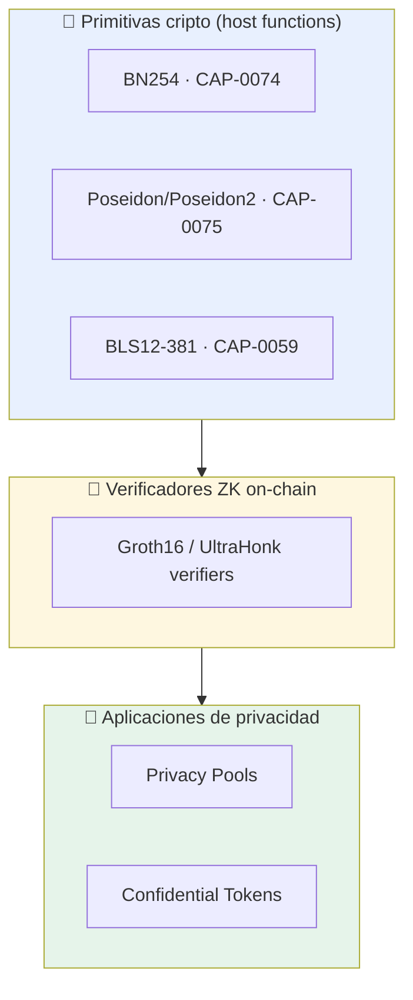

---
tags:
  - tools
  - anonimato
---

# Stack de Privacidad en Stellar

El mapa conceptual de **qué piezas de privacidad** ofrece Stellar hoy y **cuáles usamos**
para el KYC-ZK. Fuente: docs *Privacy on Stellar* + *ZK Proofs on Stellar* + whitepaper de
Privacy Pools.

> Doc raíz: https://developers.stellar.org/docs/build/apps/privacy
> ZK Proofs: https://developers.stellar.org/docs/build/apps/zk

---

## Las cuatro capas del stack

| Capa | Qué es | ¿La usamos en el KYC? |
|---|---|---|
| **Primitivas** | BN254, Poseidon/Poseidon2, BLS12-381 expuestas como host functions baratas. | ✅ **Sí** — son la base de la verificación Groth16 y del commitment Poseidon. |
| **Verificadores ZK** | Contratos que verifican pruebas (Groth16, UltraHonk) on-chain. | ✅ **Sí** — nuestro [[Contrato Verificador (Soroban)]]. |
| **Privacy Pools** | Depósitos/retiros visibles, transferencias internas privadas, con listas ASP allow/deny. | 🟡 **Como patrón** (commitment + nullifier + membership), no el producto. |
| **Confidential Tokens** | Confidencialidad basada en cifrado, compatible con interfaces de token existentes. | 🔸 Post-MVP / inspiración. |

---

## Por qué existe esto (la línea temporal)

- **Stellar X-Ray (Protocol 25)** — introdujo las primitivas ZK y la estrategia de
  privacidad de largo plazo.
  https://stellar.org/blog/developers/announcing-stellar-x-ray-protocol-25
- **Yardstick (Protocol 26)** — abarató la verificación de pruebas y mejoró el soporte para
  builders ZK (Noir significativamente más barato).
  https://stellar.org/blog/foundation-news/stellar-yardstick-protocol-26-upgrade-guide

→ Ya documentado desde el ángulo conceptual en
[[Stellar X-Ray (P25) y Yardstick (P26) — la base ZK]].

---

## Privacy Pools — el patrón que más reutilizamos

**Whitepaper** (Buterin, Illum, Nadler, Schär, Soleimani):
https://privacypools.com/whitepaper.pdf

Idea: privacidad **compatible con compliance**. Depósitos y retiros son visibles, pero las
transferencias dentro del pool son privadas, y un **ASP (Association Set Provider)** publica
listas allow/deny de membresía.

> 💡 **Mapeo a nuestro KYC:** no movemos fondos, pero reutilizamos la mecánica:
> - **commitment** = `Poseidon(atributos, secret)` → como el del depósito.
> - **nullifier** = evita doble uso → garantiza **una persona = una identidad**.
> - **membership** (ASP) = nuestra **lista de issuers confiables** (`issuer_root`).
>
> Es el mismo esqueleto criptográfico, aplicado a identidad en vez de a pagos. Ver
> [[Prueba de Persona Única]] y [[Modelo de Datos]].

Implementación de referencia: [[Verificadores ZK de referencia#2. Privacy Pools PoC (Nethermind) — el patrón más cercano a un KYC privado]].

---

## Confidential Tokens (contexto, post-MVP)

- **Confidential Token Association** (SDF, Nethermind, OpenZeppelin, Zama):
  https://www.confidentialtoken.org/
- Demo/overview (video): https://www.youtube.com/watch?v=6NnDqVQYOHM

Estándar abierto de confidencialidad on-chain **basada en cifrado**, compatible con
interfaces de token existentes. No es el núcleo de nuestro KYC, pero es relevante si la
[[Plataforma de Opinión Verificada|capa 2]] necesitara tokens/credenciales confidenciales.

---

## Relacionado

- [[Primitivas ZK en Stellar]] — detalle de BN254 / Poseidon en Soroban.
- [[Verificadores ZK de referencia]] · [[Recursos ZK & Privacy en Stellar]]
- [[Prueba de Persona Única]] · [[Modelo de Datos]] · [[Diseño del Circuito ZK]]
- [[Stellar X-Ray (P25) y Yardstick (P26) — la base ZK]]
