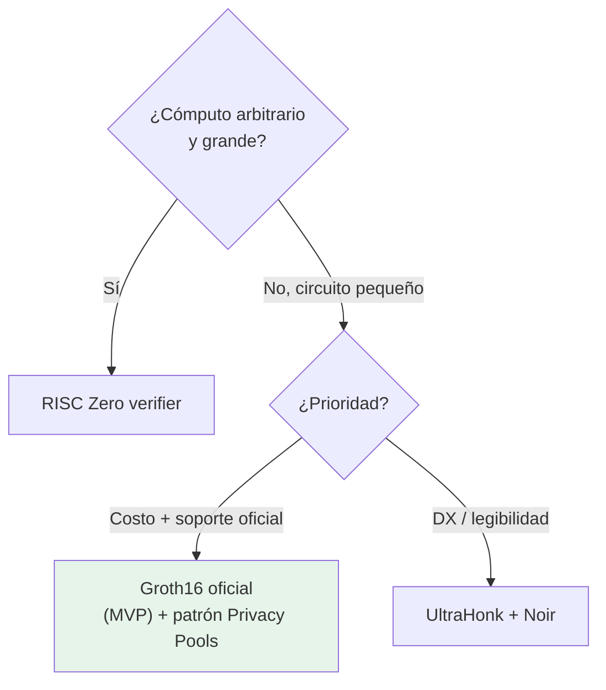

---
tags:
  - tools
  - capa/1-identidad
  - zk
  - soroban
---

# Verificadores ZK de referencia

Lo más parecido a **starter code** para nuestro proyecto: contratos verificadores
**desplegables** que podemos estudiar, forkear y construir encima. Nuestro
[[Contrato Verificador (Soroban)]] va a nacer de uno de estos.

> 🎯 Para el MVP, el candidato directo es el **Groth16 verifier oficial** (encaja con
> Circom + BN254). Los demás sirven como patrón o plan B. Decisión en
> [[Comparativa de Herramientas ZK]].

---

## Tabla de candidatos

| Verificador | Repo | Sistema | Curva / curva de prueba | Estado |
|---|---|---|---|---|
| **Groth16 oficial** | [soroban-examples/groth16_verifier](https://github.com/stellar/soroban-examples/tree/main/groth16_verifier) | Groth16 (Circom) | BN254 | ✅ Oficial — **MVP** |
| **Privacy Pools PoC** | [stellar-private-payments](https://github.com/NethermindEth/stellar-private-payments) | Groth16 (Circom) | BN254 | ⚠️ Prototipo (no auditado) |
| **RISC Zero** | [stellar-risc0-verifier](https://github.com/NethermindEth/stellar-risc0-verifier) | Groth16 desde zkVM | — | Producción-ish (Nethermind) |
| **UltraHonk (Noir)** | [rs-soroban-ultrahonk](https://github.com/yugocabrio/rs-soroban-ultrahonk) · [ultrahonk_soroban_contract](https://github.com/indextree/ultrahonk_soroban_contract) | UltraHonk / Barretenberg | — | Comunitario |

---

## 1. Groth16 verifier oficial — nuestro punto de partida

- Vive en `soroban-examples/groth16_verifier`.
- Verifica pruebas Groth16 (las que genera **Circom + snarkjs**) usando las
  [[Primitivas ZK en Stellar|primitivas BN254]] del host.
- **Por qué para el MVP:** verificación on-chain **más barata**, mantenido oficialmente
  (menos riesgo en un plazo de hackathon), y conecta directo con nuestra toolchain elegida.

```bash
git clone https://github.com/stellar/soroban-examples
# estudiar la carpeta groth16_verifier
```

→ Lo adaptamos añadiéndole la lógica de **registro + nullifier + address binding** descrita
en [[Flujo de KYC]] y [[Modelo de Datos]].

---

## 2. Privacy Pools PoC (Nethermind) — el patrón más cercano a un KYC privado

**https://github.com/NethermindEth/stellar-private-payments**
Docs: https://nethermindeth.github.io/stellar-private-payments/

PoC de **Privacy Pools** con **circuitos Circom + pruebas Groth16 + contratos Soroban**.
Incluye:

- Un **contrato de pool**.
- Un **verificador Groth16 on-chain**.
- Contratos de **membership / non-membership** (listas ASP allow/deny).
- **Pruebas generadas client-side en el navegador vía WebAssembly** → los secretos nunca
  salen del dispositivo.

> 💡 **Por qué nos sirve muchísimo:** el patrón "commitment + nullifier + prueba generada
> en el cliente + verificación on-chain + lista de membresía" es **exactamente** la columna
> vertebral de nuestro KYC ([[Prueba de Persona Única]]). Estudiar este repo nos da el
> esqueleto completo: circuito → prover en WASM → verificador Soroban → registro.

> ⚠️ **No auditado, prototipo de investigación.** Se estudia y se adapta; no se usa con
> activos reales ni se copia sin revisión ([[Skills de IA para construir#⚠️ Verificación humana (no opcional)]]).

---

## 3. RISC Zero verifier (Nethermind)

**https://github.com/NethermindEth/stellar-risc0-verifier** ·
artículo: https://stellar.org/blog/developers/risc-zero-verifier

Verifica pruebas **Groth16 creadas con la zkVM de RISC Zero** (escribes el programa
*provable* en Rust normal). Útil si necesitáramos **cómputo arbitrario grande** off-chain.
Para nuestro circuito pequeño (firma + predicados de edad/país) es *overkill* → ver
[[RISC Zero]].

---

## 4. UltraHonk verifier (Noir / Barretenberg)

- https://github.com/yugocabrio/rs-soroban-ultrahonk
- https://github.com/indextree/ultrahonk_soroban_contract

Verificador para circuitos escritos en **[[Noir]]** (Aztec). Patrón limpio para probar una
solución/estado válido sin revelarlo. **P26 abarató** su verificación. Es nuestro
**plan B** si Circom se vuelve un cuello de botella de DX.

---

## Cómo elegir (árbol de decisión)



---

## Relacionado

- [[Contrato Verificador (Soroban)]] — lo que vamos a construir a partir de esto.
- [[Comparativa de Herramientas ZK]] · [[Primitivas ZK en Stellar]]
- [[Stack de Privacidad en Stellar]] — de dónde sale el patrón Privacy Pools.
- [[Setup del Entorno]] — comandos para clonar y compilar.
