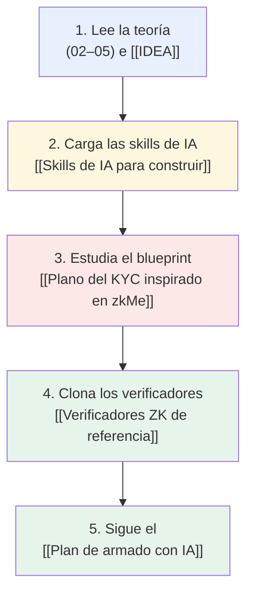

---
tags:
  - tools
---

# 🧰 Tools — Índice

Mapa de **todas las herramientas, recursos y skills** para construir el primer producto:
el **[[IDEA|KYC con ZK sobre Stellar]]** (Prueba de Persona Única). Esta carpeta toma la
data oficial de la hackathon (*Stellar Hacks: Real-World ZK* / DoraHacks) y la **une con
la idea que venimos diseñando** en las carpetas `02`–`06`, para que armar el proyecto con
una IA sea lo más directo posible.

> **Para qué sirve esta carpeta:** es el *toolbox*. Cuando vayas a desarrollar (tú o un
> agente de IA), aquí está **qué herramienta usar, dónde está su doc, qué código clonar y
> en qué orden montarlo**. La teoría vive en `02`–`05`; el *cómo construirlo* vive aquí.

---

## 🗂️ Notas de esta carpeta

| Nota | Qué resuelve |
|---|---|
| [[Recursos ZK & Privacy en Stellar]] | Catálogo curado de **todos** los enlaces oficiales (docs, tooling, SDKs, CLI, comunidad). El "índice maestro". |
| [[Skills de IA para construir]] | Las **skills de IA** (skills.stellar.org, stellar-dev-skill, stellar-build, OpenZeppelin) y cómo instalarlas para que el agente escriba mejor código. |
| [[Verificadores ZK de referencia]] | Contratos verificadores **listos para clonar y forkear** (Groth16, UltraHonk, RISC Zero, Privacy Pools PoC). El "starter code". |
| [[Stack de Privacidad en Stellar]] | El mapa conceptual de la privacidad on-chain: Privacy Pools, Confidential Tokens, X-Ray (P25), Yardstick (P26), CAPs. |
| [[Plano del KYC inspirado en zkMe]] | Cómo funciona **zkMe** y cómo lo **adaptamos** a nuestro KYC-ZK sobre Stellar (el blueprint del producto). |
| [[Plan de armado con IA]] | **Paso a paso** para construir el MVP con un agente de IA, encadenando todo lo anterior. |

---

## 🚦 Por dónde empezar

> 🎯 **Regla de oro (de la propia Stellar):** antes de que el agente escriba una sola
> línea, dile **"Read skills.stellar.org before you start building on Stellar."** Mejora
> drásticamente el código que produce. Detalle en [[Skills de IA para construir]].

---

## Relacionado

- [[IDEA]] — la visión del proyecto (léela primero).
- [[Comparativa de Herramientas ZK]] — la decisión de toolchain (Circom vs Noir vs RISC Zero).
- [[Setup del Entorno]] · [[Estructura del Codigo]] · [[Roadmap]] — implementación.
- [[Recursos Oficiales]] — la versión corta de los enlaces (esta carpeta es la versión completa).
