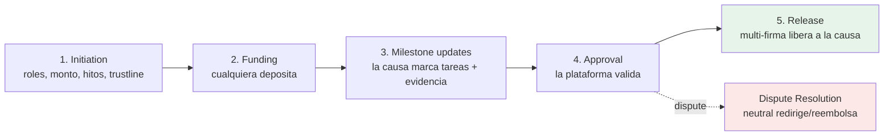

---
tags:
  - funding
  - capa/3-funding
  - zk
---

# 03 — Trustless Work (Escrow y Release)

Rol en human: **gobierna cuándo y si** el dinero sale hacia la causa. Es la capa de
**condiciones, aprobaciones, multi-firma y disputas**. Fuente:
https://docs.trustlesswork.com/trustless-work

## Qué es Trustless Work

**Escrow-as-a-Service** no-custodial sobre Stellar/Soroban, para stablecoins. Permite armar
flujos con **milestones (hitos)**, **aprobaciones**, **releases** y **disputas**, sin
escribir el contrato de escrow desde cero. Se maneja por **API** o **SDK React**.

## Roles del escrow (y cómo los mapeamos)

| Rol Trustless Work | Qué hace | En human |
|---|---|---|
| **Service Provider** | Ejecuta la tarea; actualiza estado del hito; sube evidencia | **La causa** (reporta avances/tareas cumplidas) |
| **Approver** | Valida que el hito se cumplió (firma aprobación) | **Plataforma** (revisa la evidencia) |
| **Release Signer** | Ejecuta la liberación de fondos | **Multi-firma: causa + plataforma + neutral** |
| **Receiver** | Destino final de los fondos | **Wallet de la causa** |
| **Dispute Resolver** | Resuelve conflictos, puede redirigir fondos | **Tercero neutral** |
| **Platform Address** | Cobra fee de plataforma; edita antes de fondear | **human** |
| **Depositor** | Cualquiera que aporta fondos (sin permisos) | **Donantes anónimos** |

> Detalle de la asignación y combos seguros/riesgosos en [[05 - Roles y Modelo de Confianza]].

## Ciclo de vida del escrow



1. **Initiation** — se definen roles, monto, hitos, fees y trustline; se crea el escrow.
2. **Funding** — cualquiera puede depositar (en nuestro caso, el aporte llega vía el
   handoff desde Blend; ver `04`).
3. **Milestone updates** — la **causa** marca tareas como hechas y sube evidencia.
4. **Approval** — la **plataforma** valida cada hito (o dispara disputa si algo no cierra).
5. **Release** — el **Release Signer (multi-firma)** libera los fondos al **Receiver**
   (causa), menos fee de plataforma.
- **Disputa (camino alternativo):** el **Dispute Resolver neutral** puede reembolsar total,
  parcial, o liberar a la causa, según el caso.

## Single-Release vs Multi-Release

- **Single-Release** — un solo pago cuando **todos** los hitos están aprobados (o por
  resolución de disputa). **Encaja con nuestro "todo-o-nada".** ← recomendado para el MVP.
- **Multi-Release** — pago **hito por hito**. Útil si en el futuro querés liberar por etapas.

## Cómo encaja con DeFindex (el handoff)

El dinero **vive en Blend** (vía DeFindex) durante la recaudación. Trustless Work es la
**autoridad de decisión**: cuando se cumplen **tareas + monto** y el **multi-firma aprueba**,
se ejecuta el **release** y el capital (con su yield) **retirado de Blend** llega a la causa.
La condición de éxito combina:

```
meta de monto alcanzada (todo-o-nada)
   AND  todas las tareas/hitos aprobados
   AND  release firmado por 2+ validadores (causa + plataforma + neutral)
=> liberar fondos (capital + yield) a la wallet de la causa
```

Si la meta no se alcanza o los hitos se rechazan → **reembolso** a donantes (ver `04`).

## Integración técnica

- **API REST** (Swagger mainnet: `api.trustlesswork.com/docs`) y **React SDK** (hooks como
  `useApproveMilestone`, `useReleaseFunds`, `useStartDispute`, `useResolveDispute`).
- Acciones clave: deploy escrow, change milestone status, approve milestone, release funds,
  dispute, resolve dispute.

## Siguiente
→ [[04 - Flujo End-to-End (con ZK)]]

## Fuentes
- [Welcome / EaaS](https://docs.trustlesswork.com/trustless-work)
- [Roles in Trustless Work](https://docs.trustlesswork.com/trustless-work/introduction/technology-overview/roles-in-trustless-work.md)
- [Escrow Lifecycle](https://docs.trustlesswork.com/trustless-work/introduction/technology-overview/escrow-lifecycle.md)
