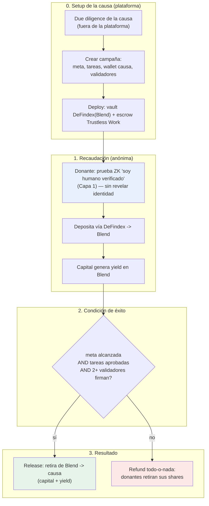

# 04 — Flujo End-to-End (con ZK)

El recorrido completo, de punta a punta, manteniendo **identidad anónima** en todo momento.

## Diagrama general

## Paso a paso

### Fase 0 — Setup (plataforma)
1. La plataforma **estudia la causa** (proceso humano, fuera de la cadena) y registra el
   resultado.
2. Crea la **campaña**: monto meta, lista de **tareas/hitos**, **wallet de la causa**,
   **validadores** (causa + plataforma + neutral).
3. **Despliega** el **vault DeFindex (estrategia Blend)** y el **escrow de Trustless Work**
   con los roles asignados.

### Fase 1 — Donación anónima
4. El donante **prueba con ZK que es un humano verificado** (credencial de Capa 1) **sin
   revelar quién es** — esto evita bots/sybil sin exponer identidad.
5. **Deposita vía DeFindex**: la API arma la tx (XDR), el donante **firma con su wallet
   anónima**, se envía. El capital entra a **Blend** y **genera yield**.
6. El donante recibe **shares** (su comprobante de aporte, base del reembolso).

### Fase 2 — Avance y validación
7. La **causa** marca **tareas cumplidas** y sube **evidencia** (en Trustless Work).
8. La **plataforma** (Approver) **valida** cada tarea. Si algo no cierra → **disputa**.

### Fase 3 — Liberación o reembolso
9. **Si** se alcanzó la **meta de monto** Y **todas las tareas** están aprobadas Y el
   **multi-firma (causa + plataforma + neutral)** firma el release:
   - Se **retira de Blend** el capital + yield y se **libera a la wallet de la causa** (menos
     fee de plataforma, si aplica).
10. **Si no** (no se llegó a la meta, o se rechazaron tareas / disputa a favor del donante):
    - **Reembolso todo-o-nada**: cada donante **retira sus shares** del vault y recupera su
      capital. (Tratamiento del yield en caso de fallo: ver decisión abierta en `08`.)

## Qué se ve on-chain vs qué queda privado

| Visible on-chain | Privado (nunca revelado) |
|---|---|
| Depósitos al vault, estado del escrow, hitos aprobados, release/refund | **Identidad del donante** |
| Wallet de la causa (receiver) | Vínculo donante ↔ persona real |
| Montos (en el MVP) | Datos personales (PII) de cualquier parte |

> El **anonimato del donante** se sostiene en la prueba ZK de personhood de Capa 1 + el uso
> de una **wallet/seudónimo no vinculable** a su identidad real. Detalle y la mecánica de
> "**revelar info solo con acuerdo de 2+**" en [[06 - ZK, Anonimato y Liberacion de Informacion]].

## Siguiente
→ [[05 - Roles y Modelo de Confianza]]
