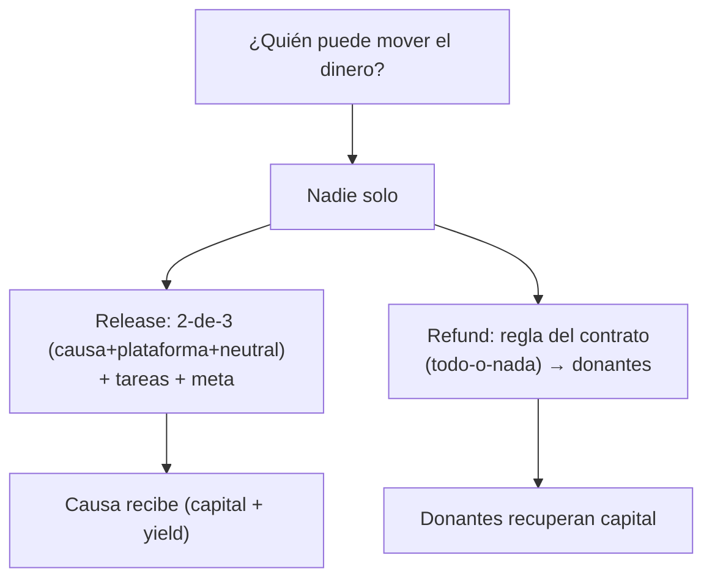

---
tags:
  - funding
  - capa/3-funding
  - zk
---

# 05 — Roles y Modelo de Confianza

Quién puede hacer qué, y por qué la combinación elegida es **segura** (nadie puede llevarse
los fondos ni liberar a dedo).

## Mapa único de actores → roles

| Actor human | Rol DeFindex (vault) | Rol Trustless Work (escrow) |
|---|---|---|
| **Donante (anónimo)** | Depositante (recibe shares) | Depositor (sin permisos de control) |
| **Causa / beneficiario** | — | **Service Provider** (reporta tareas) + **Receiver** (recibe el pago) |
| **Plataforma (human)** | **Manager** vía contrato controlador + Fee Receiver | **Approver** + **Platform Address** + 1 firma del release |
| **Tercero neutral** | (co-firma de seguridad opcional) | **Dispute Resolver** + 1 firma del release |
| **Contrato controlador** | **Manager** (reglas de release/refund) | (lee el estado del escrow) |

## El release lo firman 2+ (multi-firma)

El **Release Signer** se configura como **multi-firma** entre **causa + plataforma +
neutral** (ej. 2-de-3). Así:

- La **plataforma sola** no puede liberar (evita abuso interno).
- La **causa sola** no puede auto-pagarse (evita fraude del beneficiario).
- El **neutral** desempata y resuelve disputas.

```
Release válido = firmas( {causa, plataforma, neutral} ) >= umbral (ej. 2 de 3)
                 AND todas las tareas aprobadas
                 AND meta de monto alcanzada
```

## Por qué es no-custodial (nadie toca la plata)

- **DeFindex:** ningún rol del vault puede retirar los fondos de los usuarios (lo dice la
  doc). El capital solo sale por **release** (a la causa) o **refund** (a donantes).
- **Trustless Work:** el escrow es no-custodial; los fondos se mueven solo según los roles y
  el ciclo de vida. El **Platform Address cobra fee**, no controla los fondos.
- **Controlador como contrato:** el Manager del vault es un **contrato con reglas**, no una
  persona con llave maestra. → ver [[02 - DeFindex (Yield en Blend)]].

## Combinaciones a EVITAR (según la doc de Trustless Work)

- **Service Provider + Approver** en la misma dirección → la causa aprobaría su propio
  trabajo. ❌ (por eso Approver = plataforma, no la causa).
- **Receiver + Release Signer** sin salvaguardas → el que cobra podría dispararse el pago.
  Por eso el release es **multi-firma** y la causa es solo **una** de las firmas.
- **Una sola dirección con todos los roles** → recrea custodia centralizada. ❌

## Modelo de confianza (resumen)



## Siguiente
→ [[06 - ZK, Anonimato y Liberacion de Informacion]]

## Fuentes
- [Roles in Trustless Work](https://docs.trustlesswork.com/trustless-work/introduction/technology-overview/roles-in-trustless-work.md)
- [Vault Roles (DeFindex)](https://docs.defindex.io/getting-started/getting-started/vault-roles.md)
