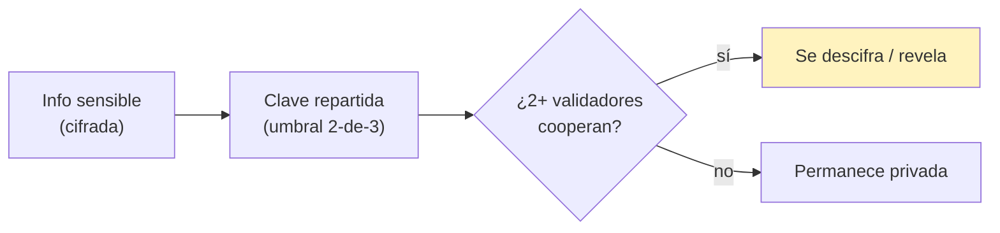

---
tags:
  - funding
  - capa/3-funding
  - anonimato
  - zk
---

# 06 — ZK, Anonimato y Liberación de Información

El **corazón** de toda la integración: mover dinero hacia causas **sin revelar identidades**,
y revelar información **solo cuando 2+ partes lo acuerdan**.

## Principio: la identidad nunca se revela

- **Donar requiere ser humano verificado** (Capa 1), pero **no requiere identificarse**. El
  donante presenta una **prueba ZK** de que pertenece al set de humanos verificados; on-chain
  solo se ve la prueba + nullifier, **nunca quién es**. → [[Flujo de KYC]], [[Puente-KYC-a-ZK]].
- Las donaciones se hacen desde una **wallet/seudónimo no vinculable** a la identidad real.
- La plataforma **no aprende** quién donó. Tampoco la causa.

## Por qué ZK acá (no es decorativo)

1. **Anti-Sybil sin exponer:** evita que bots o una misma persona inflen una campaña / voten
   mil veces en la gobernanza, **probando unicidad** sin revelar identidad (nullifier).
2. **Libertad de apoyar causas sensibles:** alguien puede financiar una causa de denuncia o
   derechos **sin miedo a represalias** (mismo espíritu que la plataforma de opinión).
3. **Elegibilidad probable:** un validador puede probar que **está autorizado** a aprobar sin
   revelar **cuál** validador es (prueba de pertenencia al set de validadores).

## Dónde entra ZK en cada paso

| Paso | Prueba ZK | Qué se oculta |
|---|---|---|
| Donar | "soy humano verificado y único" (Capa 1) | identidad del donante |
| (Opcional) Votar/gobernanza | "doné a esta campaña" sin decir cuánto/quién | vínculo donante↔voto |
| Aprobar hito / firmar release | "soy un validador autorizado" | cuál validador firmó (si se quiere) |
| Montos (mejora futura) | rango/compromiso del monto | el monto exacto |

## "Liberar información con acuerdo de 2+" (disclosure por umbral)

Pedido clave: que cierta **información sensible** (p. ej. identidad real del beneficiario,
detalles de la causa, o de un donante) **solo se revele cuando 2+ validadores lo acuerdan**.
Modelo propuesto:

- La info sensible se guarda **cifrada off-chain**; la **clave** se **reparte** entre los
  validadores (causa + plataforma + neutral) con un esquema de **umbral** (ej. 2-de-3).
- La info **solo se descifra** si el umbral de validadores **coopera** → "se libera
  información con el acuerdo de ambas/varias personas".
- Casos de uso: auditoría ante sospecha de fraude, requerimiento legal legítimo, o liberar la
  identidad de la causa al completarse el funding (si así se pactó).

> [!note] Decisión de diseño abierta
> Qué se revela exactamente, a quién, y bajo qué condiciones legales. Definir el **alcance
> mínimo** de revelación (revelar lo justo, no todo). Ver `08`.

## Reglas de oro (privacidad)

- **Nada de PII on-chain.** Solo pruebas, commitments, nullifiers, estados de escrow.
- **Minimizar revelación.** Si hay que revelar algo, revelar **lo mínimo** y solo con el
  umbral de acuerdo.
- **Separar anonimato de auditabilidad.** Se puede auditar el *flujo del dinero* (on-chain)
  sin auditar *quiénes son* las personas.
- **Coherencia con Capa 1.** El mismo secreto/credencial de personhood habilita donar; no se
  crea un segundo sistema de identidad.

## Siguiente
→ [[07 - Arquitectura y que toca en human]]
