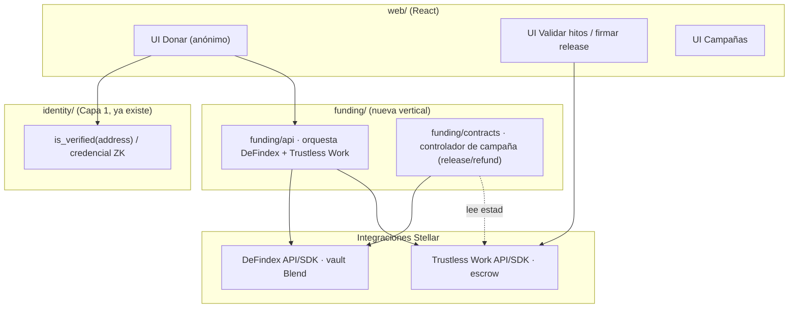

# 07 — Arquitectura y qué toca en beHuman

Cómo encaja esta vertical en el monorepo `beHuman` (org `ACRC-Zk`). Estructura base:
[[Estructura del Codigo]].

## Vista de componentes

## Carpetas nuevas / a tocar

| Acción | Ruta en `beHuman` | Qué se hace |
|---|---|---|
| **Nuevo** vertical | `funding/` | Nueva capa de aplicación (junto a `identity/` y `platform/`) |
| **Nuevo** backend | `funding/api/` | Orquesta campañas: crea vault DeFindex, deploya escrow Trustless Work, sigue estados, dispara release/refund |
| **Nuevo** contrato | `funding/contracts/campaign_controller/` | Soroban: reglas de release (meta + tareas + multi-firma) y refund (todo-o-nada). Es el **Manager** del vault DeFindex |
| **Integración** | `packages/sdk/` | Wrappers de DeFindex (deposit/withdraw/balance/apy) y Trustless Work (deploy/approve/release/dispute) |
| **Tipos** | `packages/shared/` | `Campaign`, `Milestone`, `Donation`, `EscrowState`, `VaultPosition` |
| **UI** | `web/` | Donar (anónimo), panel de validador (aprobar hitos/firmar release), páginas de campaña |
| **Reusa** | `identity/` | `is_verified(address)` / credencial para gatear donación y validación (anónimo) |
| **Config** | `.env.example` | API keys DeFindex y Trustless Work, direcciones de vault/escrow, activo (USDC testnet) |

## Puntos de integración clave (lo crítico)

1. **Manager del vault = `campaign_controller`** (contrato), no una wallet humana. Sus reglas:
   - `release()` permitido **solo si** el escrow de Trustless Work está en estado *released*
     (tareas aprobadas + multi-firma) **y** se alcanzó la meta.
   - `refund()` permitido si venció el deadline sin meta o disputa a favor de donantes
     (todo-o-nada).
2. **Handoff DeFindex → Trustless Work**: al cumplirse las condiciones, se **retira de Blend**
   y se ejecuta el **release** al Receiver (causa). Definir si el escrow **recibe** el monto
   en ese momento o si el controlador transfiere directo leyendo el estado del escrow
   (decisión en `08`).
3. **Gating por Capa 1**: donar/validar exige prueba ZK de personhood; el front llama a la
   verificación de identidad existente. **Sin PII**.
4. **Disclosure por umbral** (revelar info con 2+): módulo de cifrado + reparto de clave
   entre validadores (ver [[06 - ZK, Anonimato y Liberacion de Informacion]]).

## Qué NO se toca
- La **Capa ZK de identidad** (circuitos/`kyc_verifier`): se **reutiliza**, no se modifica.
- La **Capa 2 (opinión)**: independiente; esta es otra vertical.

## Siguiente
→ [[08 - Roadmap y Preguntas Abiertas]]
