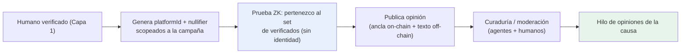

---
tags:
  - funding
  - capa/2-plataforma
  - capa/3-funding
  - anonimato
  - zk
---

# 09 — Opiniones Anónimas sobre la Causa

Suma a cada campaña de funding una **capa de opinión**: una persona **verificada con KYC-ZK**
puede **opinar sobre la petición/causa de forma totalmente incógnita**, con la misma garantía
de "humano real y único" pero **sin revelar su identidad**. Es traer la
[[Plataforma de Opinión Verificada]] (Capa 2) **adentro del funding**.

## Por qué sumar opinión al funding

- **Señal antes de donar:** la gente puede ver qué opina la comunidad **real** (no bots) sobre
  una causa antes de aportar → más confianza, menos fraude.
- **Validación social complementaria:** además de los validadores formales (causa + plataforma
  + neutral), aparece la **voz de humanos verificados**.
- **Libertad sin exposición:** podés decir "esta causa no me cierra" o "la apoyo" **sin
  exponerte**, igual que en la plaza pública de opinión.

## Reutilizamos el modelo ya implementado (Capa 2)

No inventamos un sistema de identidad nuevo: usamos el **mismo** patrón anónimo que ya corre
en testnet ([[Implementación Capa 2 (plataforma)]]):

- **Identidad anónima de plataforma:** cada persona opina como
  `platformId = Poseidon(secret, SCOPE)`, **incorrelacionable** con su KYC/PII →
  [[Identidad anónima de plataforma (platformId)]].
- **Participación gateada por ZK:** prueba de **pertenencia al árbol del issuer** (los mismos
  humanos verificados de Capa 1), **no** `is_verified(address)`. No se usa el address del KYC.
- **Almacenamiento híbrido:** ancla on-chain (`platformId + contentHash`) + contenido
  off-chain.
- **Fee anónimo:** la tx la paga una **cuenta efímera**, no el address del KYC.

## La pieza nueva: SCOPE por campaña

Para que las opiniones sean **confiables por campaña** sin romper el anonimato, el `SCOPE` se
liga a la campaña:

```
platformId_causa = Poseidon(secret, SCOPE = "funding:" + campaignId)
nullifier_causa  = Poseidon(secret, "funding-opinion:" + campaignId)
```

Esto da dos propiedades clave:

1. **Anti-Sybil por campaña (1 humano = 1 voz):** el `nullifier_causa` impide que la misma
   persona se haga pasar por muchas para inflar el sentimiento de una causa. Puede publicar
   varias opiniones, pero **bajo un único seudónimo** dentro de esa campaña.
2. **No vinculable entre campañas ni con el KYC:** el mismo humano tiene **otro** `platformId`
   en otra campaña y **ninguno** se puede atar a su identidad real.

> Es exactamente el "una persona real y única, anónima" de Capa 2, **scopeado** a la causa.

## Quién puede opinar (decisión de diseño)

- **Base:** cualquier **humano verificado** (Capa 1) puede opinar sobre cualquier campaña.
- **Opción (badge de donante):** mostrar un sello "**aportó a esta causa**" probándolo con ZK
  (prueba de que posee shares del vault) **sin revelar cuánto ni quién**. Da más peso a la
  opinión sin romper anonimato. → ver Preguntas abiertas.

## Flujo de una opinión



1. La persona prueba con ZK que es un humano verificado (sin revelar quién).
2. Genera su `platformId`/`nullifier` **scopeados a la campaña**.
3. Publica la opinión: **ancla on-chain** (`platformId + contentHash`) + **texto off-chain**.
4. Pasa por **curaduría/moderación** ([[Curaduría y Agentes Validadores]]) para evitar spam,
   discurso de odio, etc.
5. Aparece en el **hilo de opiniones** de esa causa.

## Qué se ve vs qué queda privado

| Visible | Privado (nunca) |
|---|---|
| Opinión, `platformId` (seudónimo de la causa), timestamp | Identidad real del autor |
| Que el autor es un humano verificado y único en la campaña | Vínculo con su KYC/PII o su wallet de donación |
| (Opcional) badge "aportó" | Cuánto aportó / quién es |

## Qué toca en `beHuman`

| Acción | Ruta | Qué se hace |
|---|---|---|
| **Reusa** | `platform/` (Capa 2) | Misma lógica de `platformId` + prueba de membership |
| **Nuevo** | `funding/api/opinions/` | Endpoints de opiniones por campaña (crear/listar) |
| **Contenido** | off-chain store keyed por `platformId` | Texto de la opinión |
| **Ancla** | contrato de opinión (existente) o board scopeado a `campaignId` | `platformId + contentHash` |
| **UI** | `web/` (página de campaña) | Hilo de opiniones + componer opinión anónima |
| **Curaduría** | `platform/curation/` | Moderación de opiniones de la causa |

> Reutiliza el **circuito y el árbol del issuer** de Capa 1/2: **no** se modifica la capa ZK,
> solo cambia el `SCOPE`.

## Preguntas abiertas
- [ ] ¿Opinar es libre para todo verificado, o solo donantes? (default: todo verificado;
      badge de donante opcional vía ZK).
- [ ] ¿Las opiniones tienen **sentimiento/voto** (apoyo / no apoyo) agregable, o solo texto?
- [ ] ¿La lectura del hilo es pública o solo para verificados? (alinear con
      [[Identidad Pública vs Anónima]]).
- [ ] ¿La opinión puede influir en el funding (ej. señal para validadores) o es solo social?
- [ ] Moderación: ¿agentes IA + humanos desde el día 1? → [[Curaduría y Agentes Validadores]].

## Relacionado
[[Plataforma de Opinión Verificada]] · [[Identidad anónima de plataforma (platformId)]] ·
[[Implementación Capa 2 (plataforma)]] · [[04 - Flujo End-to-End (con ZK)]] ·
[[06 - ZK, Anonimato y Liberacion de Informacion]]
